# Beam Pipeline Framework — Code Walkthrough

A detailed guide to how the framework works, illustrated with UML diagrams.
Intended for engineers onboarding to the codebase or AI agents that need deep architectural understanding.

---

## 1. Module Architecture

The project is split into five Maven modules with a strict one-way dependency rule.

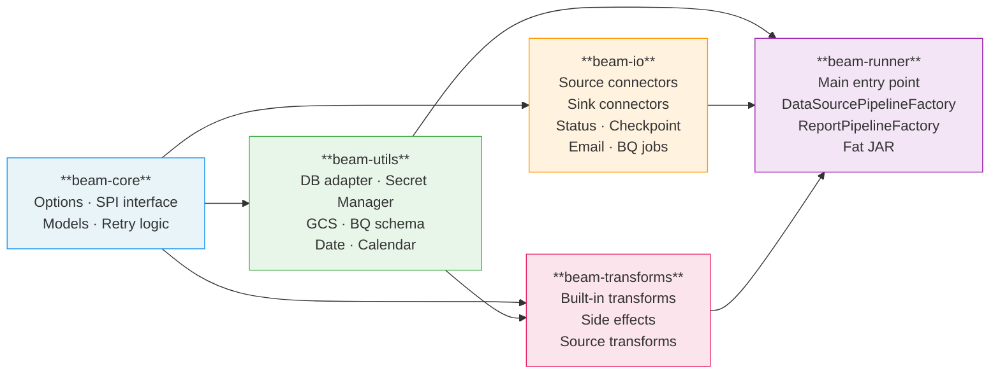

> **Rule**: arrows never point left. `beam-core` depends on nothing internal.
> `beam-io` depends only on `beam-core` — never on `beam-utils` or `beam-transforms`.

---

## 2. Entry Point — Process Type Routing

`Main.java` is the single entry point. It routes by `--processType` and `--reportName`.

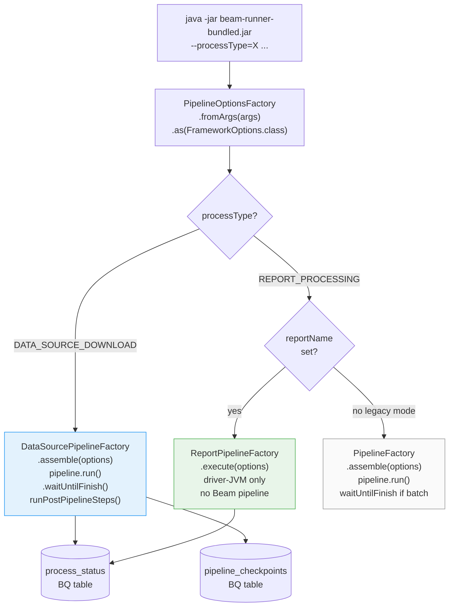

---

## 3. DATA_SOURCE_DOWNLOAD — Full Sequence

This process type reads source configuration from BigQuery, runs one independent Beam branch per source, validates output, and writes status.

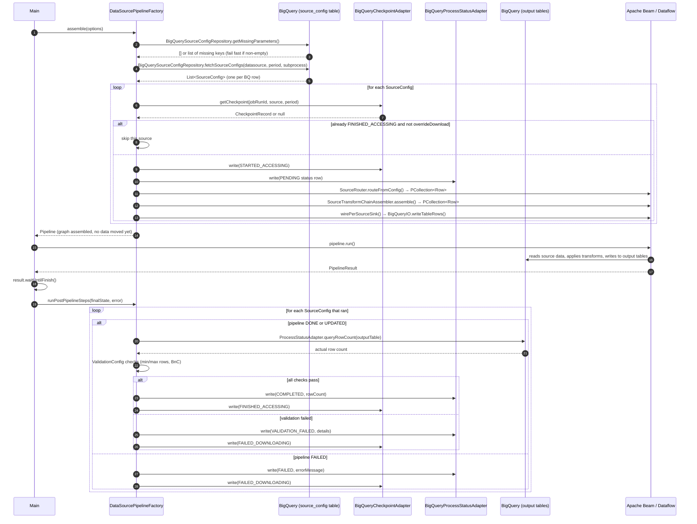

---

## 4. Per-Source Beam Branch

Each `SourceConfig` produces one independent branch of the Beam DAG. Branches are **never merged**.

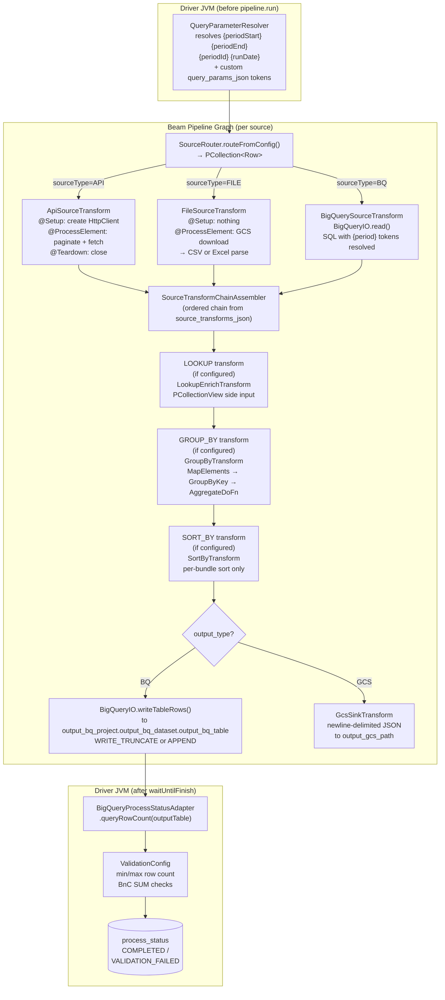

---

## 5. SourceTransformChainAssembler — Lookup Loading Detail

Lookup views are built differently depending on the lookup source type.

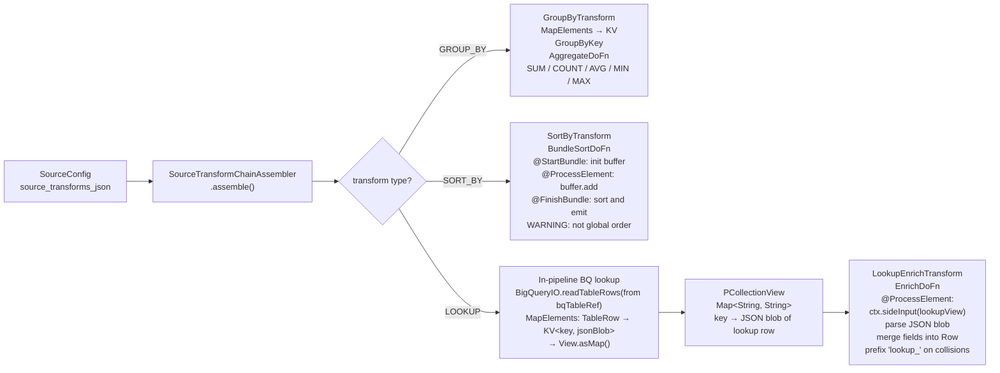

---

## 6. REPORT_PROCESSING — Full Sequence

Report processing runs entirely in the **driver JVM** — no Dataflow job is submitted.
All configuration is loaded from **BigQuery** (no JDBC). Two config patterns coexist:
- **Structured** (6 BQ tables via `BigQueryReportRepository`) — used by `ReportPipelineFactory`
- **Key-value** (`parameter_store` via `BigQueryParameterAdapter`) — used by `ExampleWorkflow` and custom runners

### 6a. ReportPipelineFactory — structured 6-table BQ config

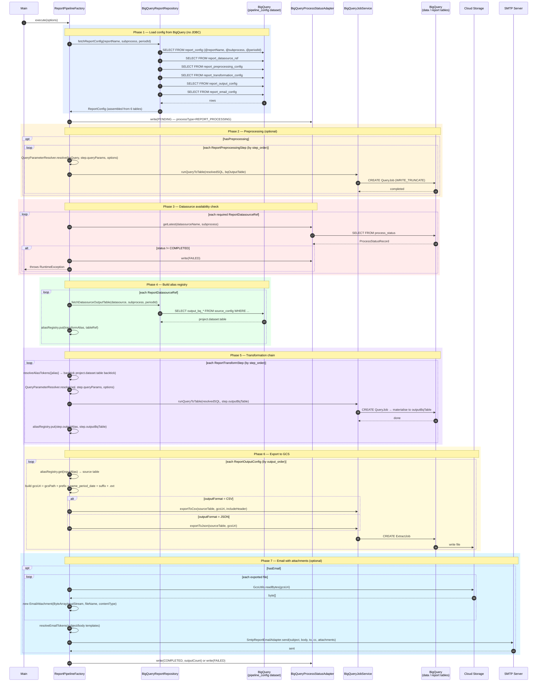

### 6b. ExampleWorkflow — key-value BigQueryParameterAdapter pattern

An alternative to the 6-table structured config. All job config lives as key-value rows
in `parameter_store`. The framework discovers which keys are needed from `required_parameters_index`
at runtime — no key names are hard-coded in Java.

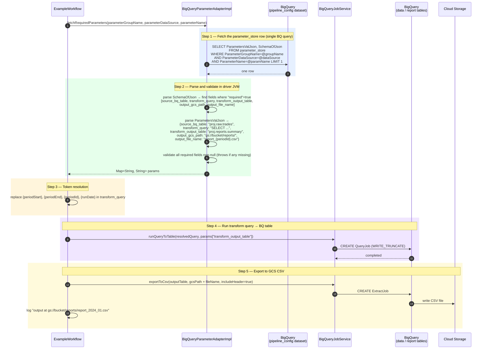

---

## 7. Query Token Resolution — Three Layers

Every SQL template in the framework goes through up to three resolution passes.

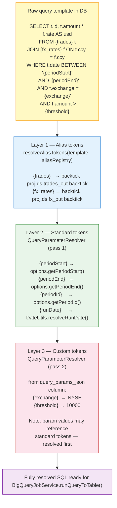

---

## 8. Process Status State Machine

Both `DATA_SOURCE_DOWNLOAD` (per source) and `REPORT_PROCESSING` write to the same `process_status` BQ table, keyed by `processType`.

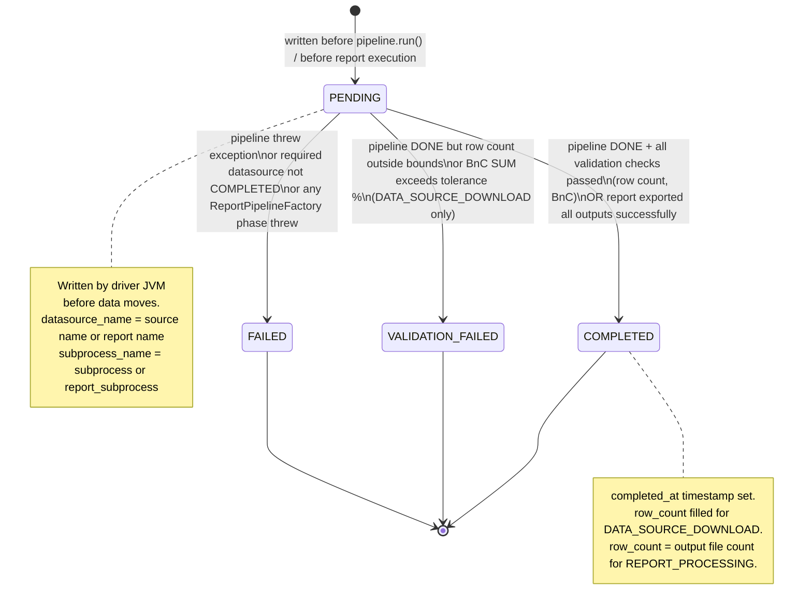

---

## 9. Key Model Relationships

```mermaid
classDiagram
    class SourceConfig {
        +String datasourceName
        +String periodId
        +String subprocessName
        +SourceType sourceType
        +ApiSourceConfig apiConfig
        +FileSourceConfig fileConfig
        +BqFetchConfig bqFetchConfig
        +OutputConfig outputConfig
        +QueryConfig queryConfig
        +List~SourceTransformConfig~ sourceTransforms
        +ValidationConfig validationConfig
        +Builder builder()
    }

    class OutputConfig {
        +String outputType
        +String bqTableRef()
        +String gcsPath
        +String writeMode
        +boolean isBq()
        +boolean isGcs()
        +boolean isTruncate()
    }

    class QueryConfig {
        +String queryTemplate
        +Map~String,String~ paramMappings
        +boolean hasTemplate()
        +static QueryConfig empty()
    }

    class SourceTransformConfig {
        +String transformType
        +List~String~ groupByFields
        +List~AggregationConfig~ aggregations
        +List~String~ sortByFields
        +LookupConfig lookupConfig
        +static groupBy()
        +static sortBy()
        +static lookup()
    }

    class ValidationConfig {
        +long minRowCount
        +long maxRowCount
        +List~String~ requiredHeaders
        +List~BncRule~ bncRules
        +boolean hasAnyCheck()
    }

    class ProcessStatusRecord {
        +String jobRunId
        +String processType
        +String datasourceName
        +String subprocessName
        +String periodId
        +String status
        +long rowCount
        +static pending()
        +static pendingReport()
        +static completed()
        +static failed()
        +static validationFailed()
        +Builder builder()
    }

    class ReportConfig {
        +String reportName
        +String reportSubprocess
        +String periodId
        +boolean overrideKey
        +List~ReportDatasourceRef~ datasources
        +List~ReportPreprocessingStep~ preprocessingSteps
        +List~ReportTransformStep~ transformSteps
        +List~ReportOutputConfig~ outputConfigs
        +ReportEmailConfig emailConfig
    }

    class ReportTransformStep {
        +int stepOrder
        +String inputAlias
        +String outputAlias
        +String queryTemplate
        +String outputBqTable
        +Map~String,String~ queryParams
    }

    class ReportDatasourceRef {
        +String datasourceName
        +String datasourceSubprocess
        +String transformAlias
        +boolean required
    }

    SourceConfig *-- OutputConfig
    SourceConfig *-- QueryConfig
    SourceConfig *-- ValidationConfig
    SourceConfig *-- SourceTransformConfig
    ReportConfig *-- ReportDatasourceRef
    ReportConfig *-- ReportTransformStep
    ReportConfig *-- ReportOutputConfig
    ReportConfig *-- ReportEmailConfig
    ReportConfig *-- ReportPreprocessingStep
```

---

## 10. BigQuery Config Tables — Entity Relationship

All configuration lives in BigQuery (`--paramBqProject.--paramBqDataset`). No JDBC.
Two layouts coexist in the same dataset:

- **Structured layout** (6 tables) — queried by `BigQueryReportRepository` for `ReportPipelineFactory`
- **Key-value layout** (2 tables) — queried by `BigQueryParameterAdapter` for `ExampleWorkflow` and custom runners

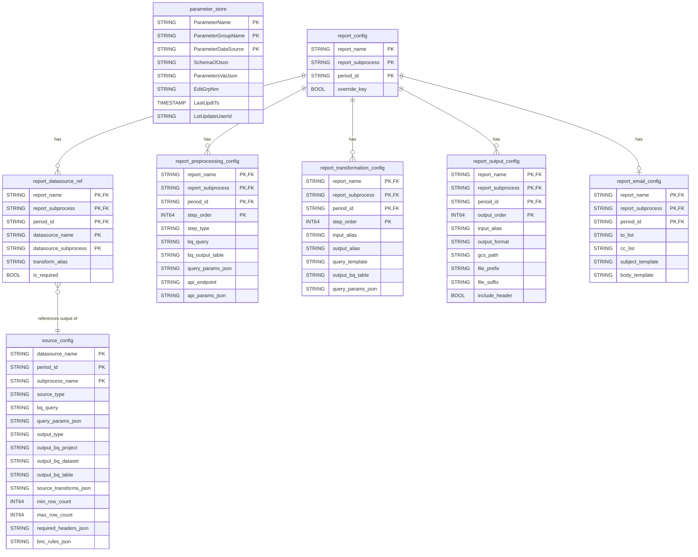

---

## 11. BigQuery Tables — Runtime State

These are BQ tables written to at runtime (not the config dataset).

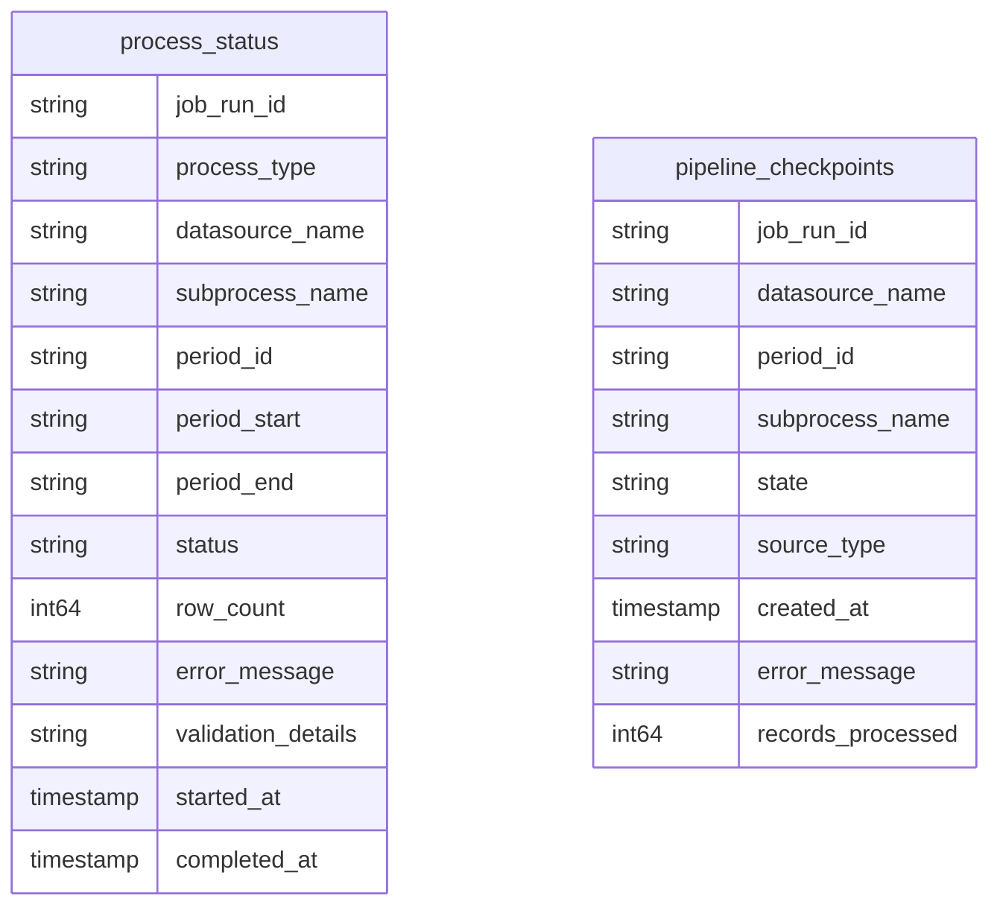

`process_status.process_type` is either `DATA_SOURCE_DOWNLOAD` or `REPORT_PROCESSING`.
For `DATA_SOURCE_DOWNLOAD`, `datasource_name` = the source name.
For `REPORT_PROCESSING`, `datasource_name` = the report name.

---

## 12. Email Adapter — Class Structure


---

## 13. DATA_SOURCE_DOWNLOAD — Airflow Configuration Example

```python
# Airflow DAG: download trades data for a monthly period
DataflowStartJobOperator(
    task_id="download_trades",
    jar="gs://bucket/jars/beam-runner-bundled.jar",
    options={
        "--processType":        "DATA_SOURCE_DOWNLOAD",
        "--datasourceName":     "trades",
        "--subprocessName":     "eod",
        "--periodId":           "2024-01",
        "--periodStart":        "2024-01-01",
        "--periodEnd":          "2024-01-31",
        "--runDate":            "{{ ds }}",
        "--paramBqProject":     "my-gcp-project",
        "--paramBqDataset":     "pipeline_config",
        "--checkpointBqDataset": "pipeline_metadata",
        "--processStatusBqDataset": "pipeline_metadata",
    }
)
```

---

## 14. REPORT_PROCESSING — Airflow Configuration Example

```python
# Airflow DAG: generate daily trades report (runs after download completes)
DataflowStartJobOperator(
    task_id="run_trades_report",
    jar="gs://bucket/jars/beam-runner-bundled.jar",
    options={
        "--processType":        "REPORT_PROCESSING",
        "--reportName":         "daily_trades_report",
        "--reportSubprocess":   "eod",
        "--periodId":           "2024-01",
        "--periodStart":        "2024-01-01",
        "--periodEnd":          "2024-01-31",
        "--runDate":            "{{ ds }}",
        "--paramBqProject":     "my-gcp-project",
        "--paramBqDataset":     "pipeline_config",        # BQ dataset holding all report config tables
        "--processStatusBqDataset": "pipeline_metadata",
        "--emailSmtpHost":      "smtp.gmail.com",
        "--emailSmtpPort":      "587",
        "--smtpPasswordSecretId": "projects/p/secrets/smtp-password/versions/latest",
        "--devErrorEmail":      "reports@company.com",
        # --sinkType is NOT required for BQ-configured REPORT_PROCESSING
    }
)
```

> **Note**: When `--reportName` is set, `--sinkType`, `--sourceType`, and `--transformChain` are not used.
> All config is loaded from BigQuery — use `--paramBqProject` + `--paramBqDataset` to point at the config dataset.

---

## 15. Code Navigation Map

Where to find things in the source tree:

| Concept | File |
|---|---|
| All CLI flags | [`beam-core/.../options/FrameworkOptions.java`](beam-core/src/main/java/com/yourco/beam/options/FrameworkOptions.java) |
| Entry point | [`beam-runner/.../runner/Main.java`](beam-runner/src/main/java/com/yourco/beam/runner/Main.java) |
| DATA_SOURCE_DOWNLOAD orchestration | [`beam-runner/.../runner/DataSourcePipelineFactory.java`](beam-runner/src/main/java/com/yourco/beam/runner/DataSourcePipelineFactory.java) |
| REPORT_PROCESSING orchestration | [`beam-runner/.../runner/ReportPipelineFactory.java`](beam-runner/src/main/java/com/yourco/beam/runner/ReportPipelineFactory.java) |
| Source routing | [`beam-io/.../io/source/SourceRouter.java`](beam-io/src/main/java/com/yourco/beam/io/source/SourceRouter.java) |
| Per-source transform chain | [`beam-runner/.../runner/SourceTransformChainAssembler.java`](beam-runner/src/main/java/com/yourco/beam/runner/SourceTransformChainAssembler.java) |
| Lookup transform (side input) | [`beam-transforms/.../transforms/source/LookupEnrichTransform.java`](beam-transforms/src/main/java/com/yourco/beam/transforms/source/LookupEnrichTransform.java) |
| Group-by transform | [`beam-transforms/.../transforms/source/GroupByTransform.java`](beam-transforms/src/main/java/com/yourco/beam/transforms/source/GroupByTransform.java) |
| Query token resolution | [`beam-utils/.../utils/QueryParameterResolver.java`](beam-utils/src/main/java/com/yourco/beam/utils/QueryParameterResolver.java) |
| Source config loading (DATA_SOURCE_DOWNLOAD, BQ) | [`beam-io/.../io/config/BigQuerySourceConfigRepository.java`](beam-io/src/main/java/com/yourco/beam/io/config/BigQuerySourceConfigRepository.java) |
| Report config loading (REPORT_PROCESSING, BQ) | [`beam-io/.../io/config/BigQueryReportRepository.java`](beam-io/src/main/java/com/yourco/beam/io/config/BigQueryReportRepository.java) |
| Key-value BQ parameter store | [`beam-io/.../io/params/BigQueryParameterAdapter.java`](beam-io/src/main/java/com/yourco/beam/io/params/BigQueryParameterAdapter.java) |
| BQ job execution | [`beam-io/.../io/report/BigQueryJobService.java`](beam-io/src/main/java/com/yourco/beam/io/report/BigQueryJobService.java) |
| End-to-end BQ param example | [`beam-runner/.../runner/example/ExampleWorkflow.java`](beam-runner/src/main/java/com/yourco/beam/runner/example/ExampleWorkflow.java) |
| Process status tracking | [`beam-io/.../io/status/BigQueryProcessStatusAdapter.java`](beam-io/src/main/java/com/yourco/beam/io/status/BigQueryProcessStatusAdapter.java) |
| Email interface | [`beam-io/.../io/email/ReportEmailAdapter.java`](beam-io/src/main/java/com/yourco/beam/io/email/ReportEmailAdapter.java) |
| Email SMTP implementation | [`beam-runner/.../runner/SmtpReportEmailAdapter.java`](beam-runner/src/main/java/com/yourco/beam/runner/SmtpReportEmailAdapter.java) |
| Checkpoint adapter | [`beam-io/.../io/checkpoint/BigQueryCheckpointAdapter.java`](beam-io/src/main/java/com/yourco/beam/io/checkpoint/BigQueryCheckpointAdapter.java) |
