# Beam Pipeline Framework — Code Walkthrough

A detailed guide to how the framework works, illustrated with UML diagrams.
Intended for engineers onboarding to the codebase or AI agents that need deep architectural understanding.

---

## 1. Module Architecture

The project is split into five Maven modules with a strict one-way dependency rule.

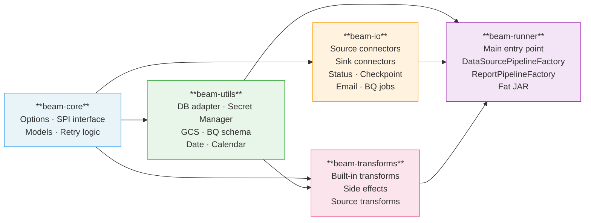

> **Rule**: arrows never point left. `beam-core` depends on nothing internal.
> `beam-io` depends only on `beam-core` — never on `beam-utils` or `beam-transforms`.

---

## 2. Entry Point — Process Type Routing

`Main.java` is the single entry point. It routes by `--processType` and `--reportName`.

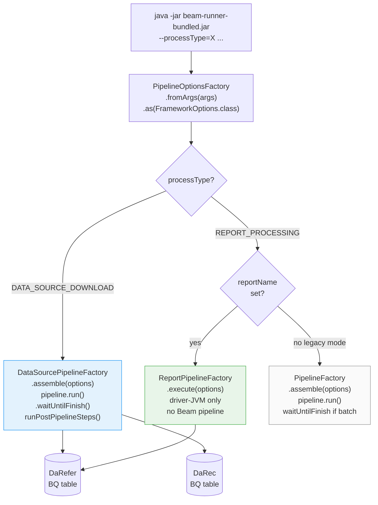

---

## 3. DATA_SOURCE_DOWNLOAD — Full Sequence

This process type reads source configuration from BigQuery, runs one independent Beam branch per source, validates output, and writes lifecycle state to `DaRefer`.

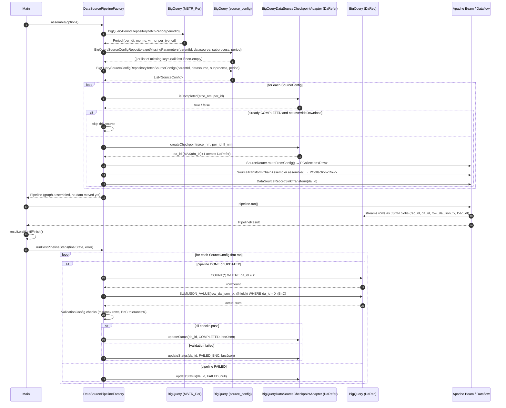

---

## 4. Per-Source Beam Branch

Each `SourceConfig` produces one independent branch of the Beam DAG. Branches are **never merged**.

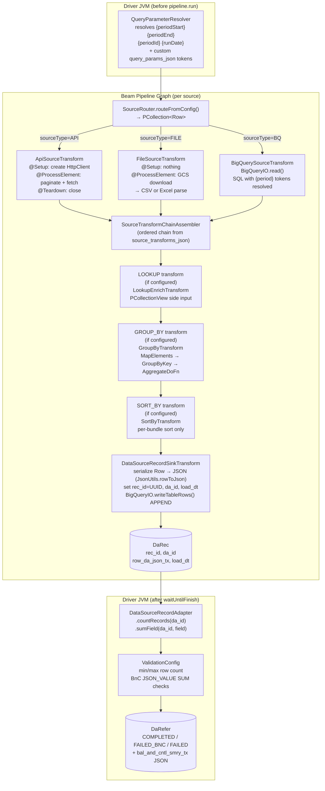

---

## 5. SourceTransformChainAssembler — Lookup Loading Detail

Lookup views are built differently depending on the lookup source type.

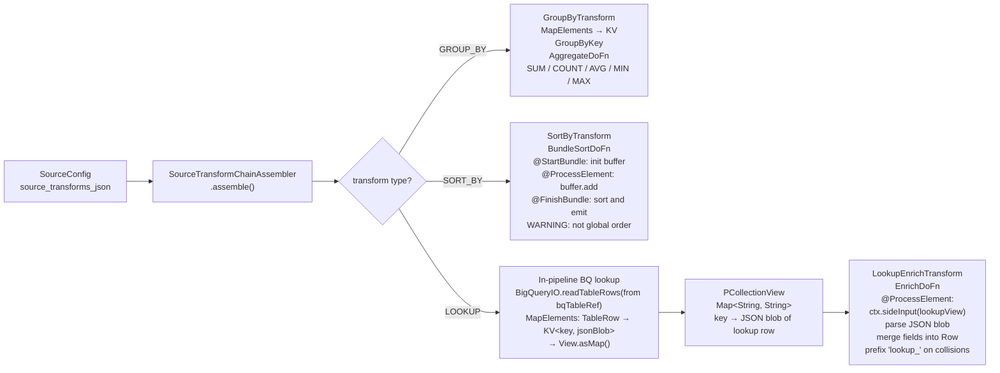

---

## 6. REPORT_PROCESSING — Full Sequence

Report processing runs entirely in the **driver JVM** — no Dataflow job is submitted.
All configuration is loaded from **BigQuery** (no JDBC). Two config patterns coexist:
- **Nested JSON** (`parameter_store` via `BigQueryReportRepository`) — used by `ReportPipelineFactory`
- **Flat key-value** (`parameter_store` via `BigQueryParameterAdapter`) — used by `ExampleWorkflow`

Both read the same `parameter_store` table; they differ only in how `parameters_val_json` is structured.

### 6a. ReportPipelineFactory — parameter_store nested JSON config

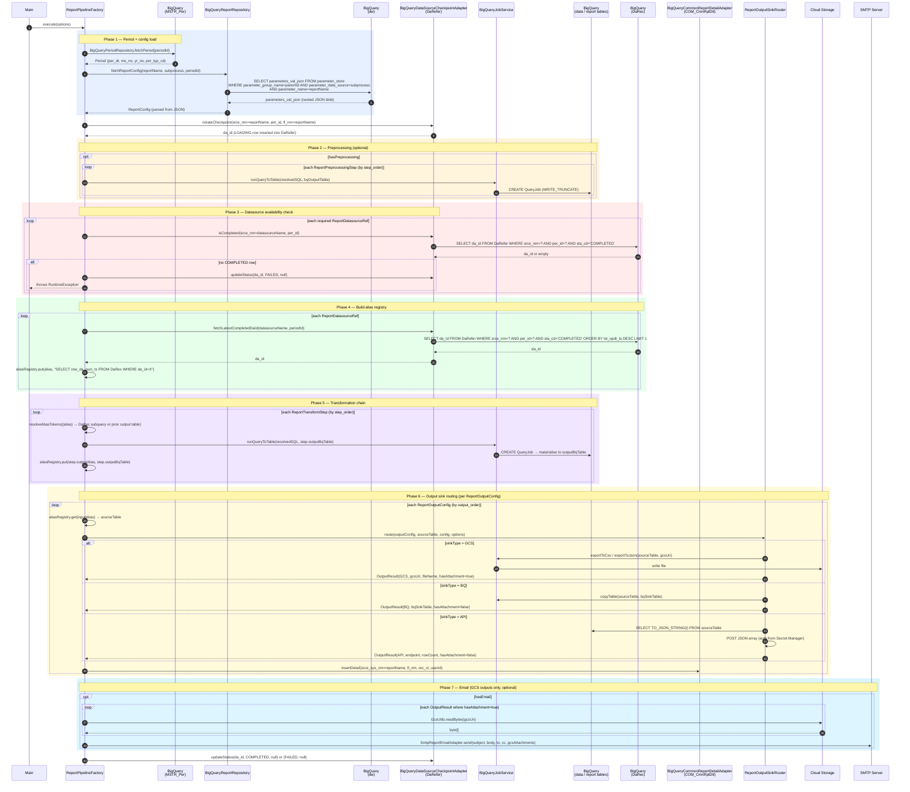

### 6b. ExampleWorkflow — key-value BigQueryParameterAdapter pattern

An alternative to the 6-table structured config. All job config lives as key-value rows
in `parameter_store`. The framework discovers which keys are needed from `required_parameters_index`
at runtime — no key names are hard-coded in Java.

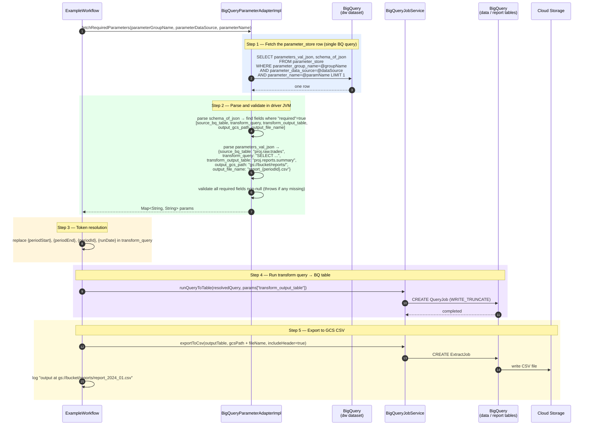

---

## 7. Query Token Resolution — Three Layers

Every SQL template in the framework goes through up to three resolution passes.

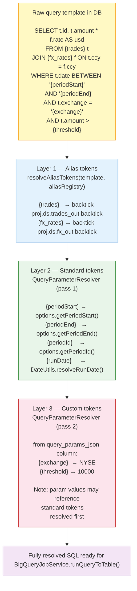

---

## 8. DaRefer State Machine

Both `DATA_SOURCE_DOWNLOAD` (per source) and `REPORT_PROCESSING` write to `DaRefer`.
Each run creates one row (`sta_cd=LOADING`), then updates it to a terminal state.

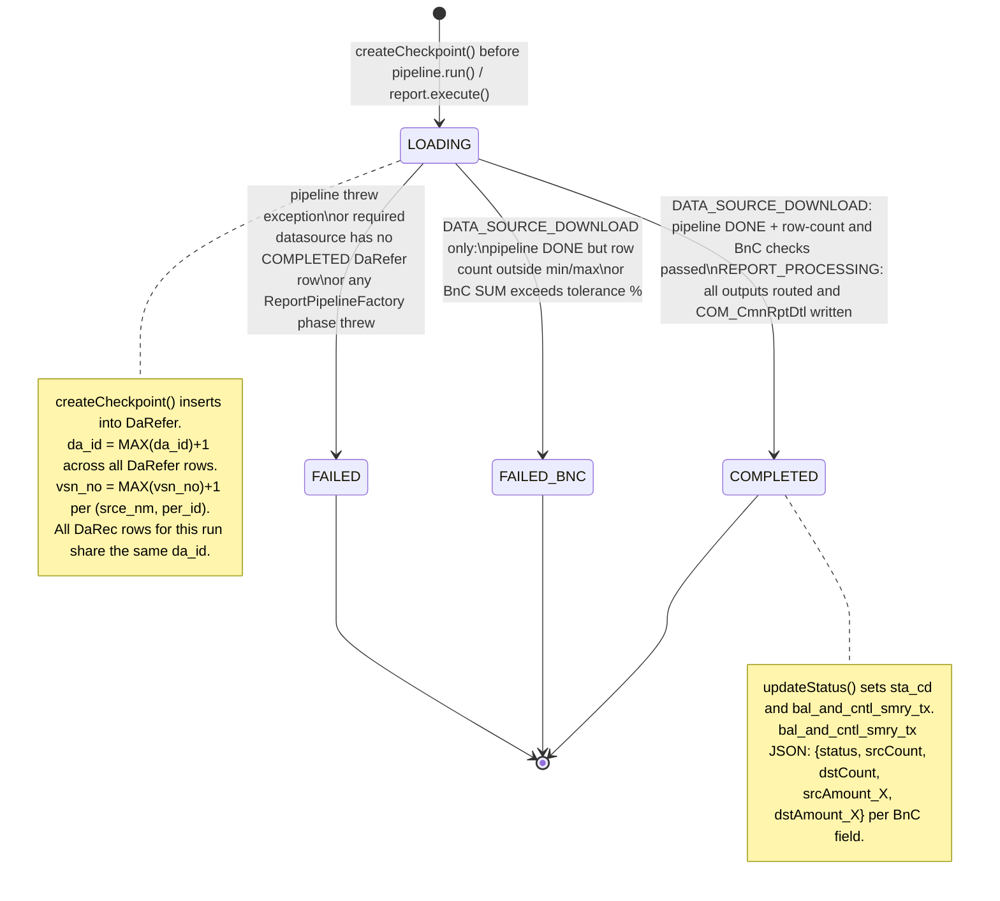

---

## 9. Key Model Relationships

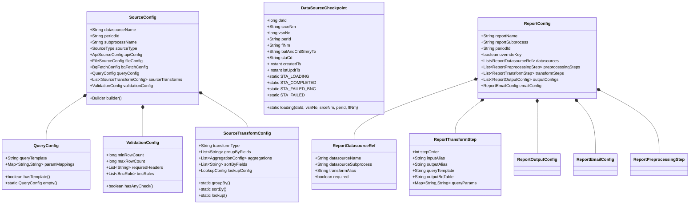

---

## 10. BigQuery Config Tables — Entity Relationship

All configuration lives in BigQuery (`--paramBqProject.--paramBqDataset`). No JDBC.
A single `parameter_store` table holds all configuration for both pipeline types:

- **Source configs** (DATA_SOURCE_DOWNLOAD) — flat JSON in `parameters_val_json`, read by `BigQuerySourceConfigRepository`
- **Report configs** (REPORT_PROCESSING) — nested JSON blob in `parameters_val_json`, read by `BigQueryReportRepository`

The lookup key is always `(parameter_group_name, parameter_data_source, parameter_name)`.
`periodId` is never a lookup key — configs are period-agnostic.

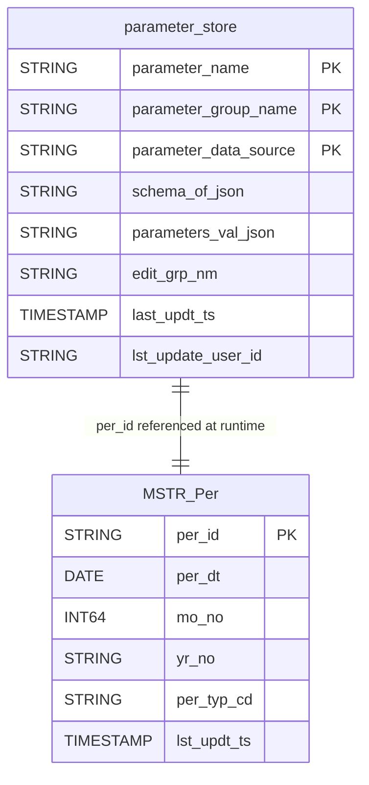

### parameters_val_json: source config (flat JSON)
```json
{"source_type": "BQ", "bq_query": "SELECT ...", "min_row_count": "1", ...}
```

### parameters_val_json: report config (nested JSON)
```json
{
  "override_key": false,
  "datasources":  [{"datasource_name": "trades", "transform_alias": "raw_trades", "is_required": true, ...}],
  "preprocessing": [],
  "transforms":   [{"step_order": 1, "input_alias": "raw_trades", "output_alias": "summary", "query_template": "...", ...}],
  "outputs":      [{"output_order": 1, "input_alias": "summary", "sink_type": "GCS", "output_format": "CSV", ...}],
  "email":        {"to_list": ["analyst@example.com"], "subject_template": "Report {periodId}", ...}
}
```

---

## 11. BigQuery Tables — Runtime State

These tables are written at runtime (in `--checkpointBqDataset`, default `pipeline_metadata`).
Both process types use `DaRefer`. `DATA_SOURCE_DOWNLOAD` writes `DaRec`. `REPORT_PROCESSING` writes `COM_CmnRptDtl`.

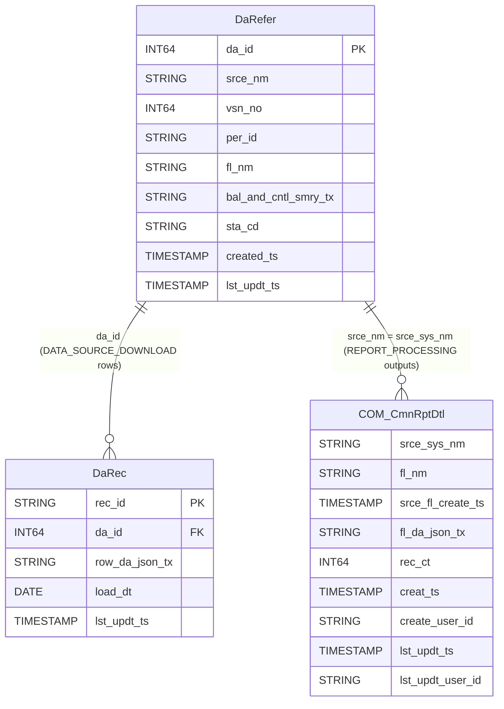

`sta_cd` values: `LOADING` | `COMPLETED` | `FAILED_BNC` | `FAILED`.

For `DATA_SOURCE_DOWNLOAD`: `srce_nm` = datasource name, `fl_nm` = BQ table ref / file path / API endpoint.
For `REPORT_PROCESSING`: `srce_nm` = report name, `fl_nm` = report name.

`vsn_no` increments each time the same `(srce_nm, per_id)` is re-run (e.g. after `--overrideDownload=true`).

`bal_and_cntl_smry_tx` (BnC summary JSON, DATA_SOURCE_DOWNLOAD only):
```json
{ "status": "Matched", "srcCount": 1000, "srcAmount": 5000000.00, "dstCount": 1000, "dstAmount": 5000000.00 }
```

`COM_CmnRptDtl` — one row per output step, written by `REPORT_PROCESSING` for all sink types (GCS, BQ, API).
`fl_nm` = GCS file name, destination BQ table, or API endpoint. `rec_ct` = row count written to that sink.

---

## 12. Email Adapter — Class Structure

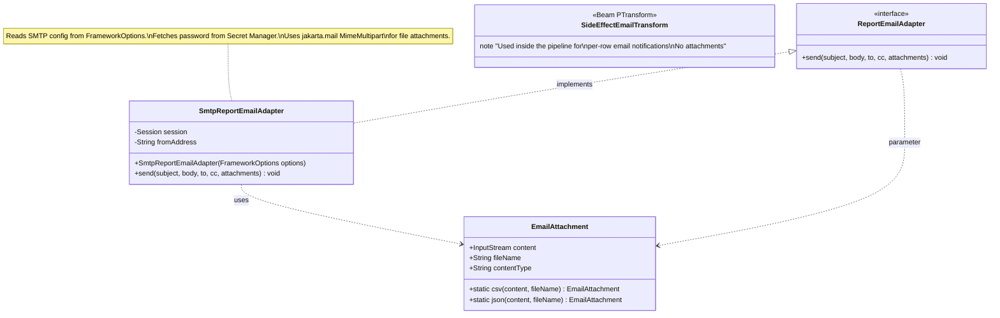

---

## 13. DATA_SOURCE_DOWNLOAD — Airflow Configuration Example

```python
# Airflow DAG: download trades data for a monthly period
DataflowStartJobOperator(
    task_id="download_trades",
    jar="gs://bucket/jars/beam-runner-bundled.jar",
    options={
        "--processType":         "DATA_SOURCE_DOWNLOAD",
        "--parentId":            "TRADING",      # → parent_id in source_config
        "--datasourceName":      "trades",
        "--subprocessName":      "eod",
        "--periodId":            "202401",        # MONTHLY YYYYMM — must exist in MSTR_Per
        "--periodStart":         "2024-01-01",
        "--periodEnd":           "2024-01-31",
        "--runDate":             "{{ ds }}",
        "--paramBqProject":      "my-gcp-project",
        "--paramBqDataset":      "dw",
        "--checkpointBqProject": "my-gcp-project",
        "--checkpointBqDataset": "pipeline_metadata",
        "--daReferTable":        "DaRefer",
        "--daRecTable":          "DaRec",
    }
)
```

---

## 14. REPORT_PROCESSING — Airflow Configuration Example

```python
# Airflow DAG: generate daily trades report (runs after download completes)
DataflowStartJobOperator(
    task_id="run_trades_report",
    jar="gs://bucket/jars/beam-runner-bundled.jar",
    options={
        "--processType":         "REPORT_PROCESSING",
        "--parentId":            "TRADING",      # → parameter_group_name in parameter_store
        "--reportName":          "daily_trades_summary",
        "--reportSubprocess":    "eod",
        "--periodId":            "202401",        # MONTHLY YYYYMM — must exist in MSTR_Per
        "--periodStart":         "2024-01-01",
        "--periodEnd":           "2024-01-31",
        "--runDate":             "{{ ds }}",
        "--paramBqProject":      "my-gcp-project",
        "--paramBqDataset":      "dw",
        "--checkpointBqProject": "my-gcp-project",
        "--checkpointBqDataset": "pipeline_metadata",
        "--daReferTable":        "DaRefer",
        "--daRecTable":          "DaRec",
        "--cmnRptDtlTable":      "COM_CmnRptDtl",
        "--emailSmtpHost":       "smtp.gmail.com",
        "--emailSmtpPort":       "587",
        "--smtpPasswordSecretId": "projects/p/secrets/smtp-password/versions/latest",
        "--devErrorEmail":       "reports@company.com",
        # --sinkType / --sourceType / --transformChain are NOT used here;
        # all output routing comes from parameter_store outputs[].sink_type (GCS | BQ | API)
    }
)
```

> **Note**: When `--reportName` is set, `--sinkType`, `--sourceType`, and `--transformChain` are not used.
> All config (including output sink type per output step) is loaded from BigQuery.

---

## 15. Code Navigation Map

Where to find things in the source tree:

| Concept | File |
|---|---|
| All CLI flags | [`beam-core/.../options/FrameworkOptions.java`](beam-core/src/main/java/com/yourco/beam/options/FrameworkOptions.java) |
| Entry point | [`beam-runner/.../runner/Main.java`](beam-runner/src/main/java/com/yourco/beam/runner/Main.java) |
| DATA_SOURCE_DOWNLOAD orchestration | [`beam-runner/.../runner/DataSourcePipelineFactory.java`](beam-runner/src/main/java/com/yourco/beam/runner/DataSourcePipelineFactory.java) |
| REPORT_PROCESSING orchestration | [`beam-runner/.../runner/ReportPipelineFactory.java`](beam-runner/src/main/java/com/yourco/beam/runner/ReportPipelineFactory.java) |
| Source routing | [`beam-io/.../io/source/SourceRouter.java`](beam-io/src/main/java/com/yourco/beam/io/source/SourceRouter.java) |
| Per-source transform chain | [`beam-runner/.../runner/SourceTransformChainAssembler.java`](beam-runner/src/main/java/com/yourco/beam/runner/SourceTransformChainAssembler.java) |
| Lookup transform (side input) | [`beam-transforms/.../transforms/source/LookupEnrichTransform.java`](beam-transforms/src/main/java/com/yourco/beam/transforms/source/LookupEnrichTransform.java) |
| Group-by transform | [`beam-transforms/.../transforms/source/GroupByTransform.java`](beam-transforms/src/main/java/com/yourco/beam/transforms/source/GroupByTransform.java) |
| Query token resolution | [`beam-utils/.../utils/QueryParameterResolver.java`](beam-utils/src/main/java/com/yourco/beam/utils/QueryParameterResolver.java) |
| Source config loading (DATA_SOURCE_DOWNLOAD, BQ) | [`beam-io/.../io/config/BigQuerySourceConfigRepository.java`](beam-io/src/main/java/com/yourco/beam/io/config/BigQuerySourceConfigRepository.java) |
| Report config loading (REPORT_PROCESSING, BQ) | [`beam-io/.../io/config/BigQueryReportRepository.java`](beam-io/src/main/java/com/yourco/beam/io/config/BigQueryReportRepository.java) |
| Key-value BQ parameter store | [`beam-io/.../io/params/BigQueryParameterAdapter.java`](beam-io/src/main/java/com/yourco/beam/io/params/BigQueryParameterAdapter.java) |
| BQ job execution | [`beam-io/.../io/report/BigQueryJobService.java`](beam-io/src/main/java/com/yourco/beam/io/report/BigQueryJobService.java) |
| End-to-end BQ param example | [`beam-runner/.../runner/example/ExampleWorkflow.java`](beam-runner/src/main/java/com/yourco/beam/runner/example/ExampleWorkflow.java) |
| Checkpoint lifecycle (LOADING→COMPLETED/FAILED) | [`beam-io/.../io/checkpoint/BigQueryDataSourceCheckpointAdapter.java`](beam-io/src/main/java/com/yourco/beam/io/checkpoint/BigQueryDataSourceCheckpointAdapter.java) |
| Record table sink (all sources → JSON blobs) | [`beam-io/.../io/sink/DataSourceRecordSinkTransform.java`](beam-io/src/main/java/com/yourco/beam/io/sink/DataSourceRecordSinkTransform.java) |
| Record validation (BnC via JSON_VALUE) | [`beam-io/.../io/records/BigQueryDataSourceRecordAdapter.java`](beam-io/src/main/java/com/yourco/beam/io/records/BigQueryDataSourceRecordAdapter.java) |
| Email interface | [`beam-io/.../io/email/ReportEmailAdapter.java`](beam-io/src/main/java/com/yourco/beam/io/email/ReportEmailAdapter.java) |
| Email SMTP implementation | [`beam-runner/.../runner/SmtpReportEmailAdapter.java`](beam-runner/src/main/java/com/yourco/beam/runner/SmtpReportEmailAdapter.java) |
