# Beam Pipeline Framework — Code Walkthrough

A detailed guide to how the framework works, illustrated with UML diagrams.
Intended for engineers onboarding to the codebase or AI agents that need deep architectural understanding.

---

## 1. Module Architecture

The project is split into five Maven modules with a strict one-way dependency rule.

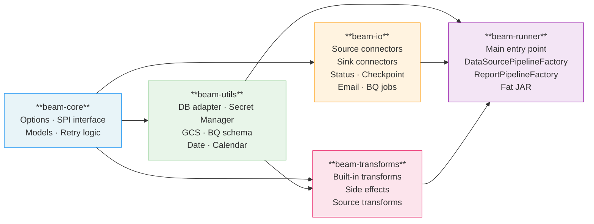
```mermaid
flowchart LR
    core["**beam-core**\nOptions · SPI interface\nModels · Retry logic"]
    utils["**beam-utils**\nDB adapter · Secret Manager\nGCS · BQ schema\nDate · Calendar"]
    io["**beam-io**\nSource connectors\nSink connectors\nStatus · Checkpoint\nEmail · BQ jobs"]
    transforms["**beam-transforms**\nBuilt-in transforms\nSide effects\nSource transforms"]
    runner["**beam-runner**\nMain entry point\nDataSourcePipelineFactory\nReportPipelineFactory\nFat JAR"]

    core --> utils
    core --> io
    core --> transforms
    utils --> transforms
    utils --> runner
    io --> runner
    transforms --> runner

    style core fill:#e8f4f8,stroke:#2196F3
    style utils fill:#e8f5e9,stroke:#4CAF50
    style io fill:#fff3e0,stroke:#FF9800
    style transforms fill:#fce4ec,stroke:#E91E63
    style runner fill:#f3e5f5,stroke:#9C27B0
```

> **Rule**: arrows never point left. `beam-core` depends on nothing internal.
> `beam-io` depends only on `beam-core` — never on `beam-utils` or `beam-transforms`.

---

## 2. Entry Point — Process Type Routing

`Main.java` is the single entry point. It routes by `--processType` and `--reportName`.

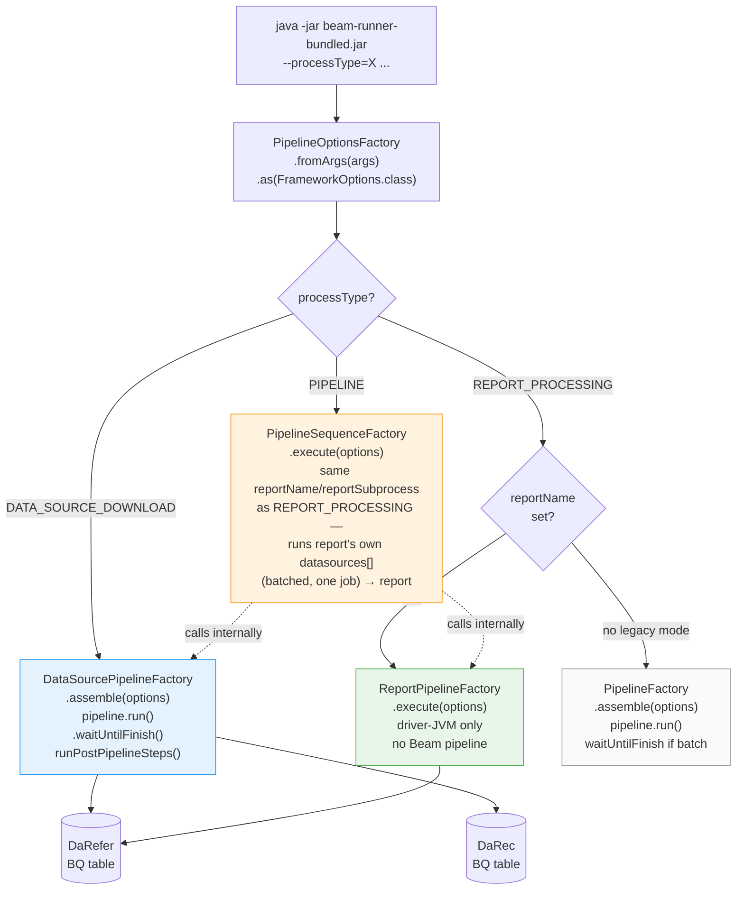
```mermaid
flowchart TD
    A["java -jar beam-runner-bundled.jar\n--processType=X ..."] --> B["PipelineOptionsFactory\n.fromArgs(args)\n.as(FrameworkOptions.class)"]
    B --> C{processType?}

    C -->|DATA_SOURCE_DOWNLOAD| D["DataSourcePipelineFactory\n.assemble(options)\npipeline.run()\n.waitUntilFinish()\nrunPostPipelineSteps()"]

    C -->|REPORT_PROCESSING| E{reportName\nset?}
    E -->|yes| F["ReportPipelineFactory\n.execute(options)\ndriver-JVM only\nno Beam pipeline"]
    E -->|no legacy mode| G["PipelineFactory\n.assemble(options)\npipeline.run()\nwaitUntilFinish if batch"]

    C -->|PIPELINE| P["PipelineSequenceFactory\n.execute(options)\nsame reportName/reportSubprocess\nas REPORT_PROCESSING —\nruns report's own datasources[]\n(batched, one job) → report"]
    P -.calls internally.-> D
    P -.calls internally.-> F

    D --> H[("DaRefer\nBQ table")]
    F --> H
    D --> I[("DaRec\nBQ table")]

    style F fill:#e8f5e9,stroke:#4CAF50
    style D fill:#e3f2fd,stroke:#2196F3
    style G fill:#fafafa,stroke:#999
    style P fill:#fff3e0,stroke:#FB8C00
```

---

## 3. DATA_SOURCE_DOWNLOAD — Full Sequence

This process type reads source configuration from BigQuery, runs one independent Beam branch per source, validates output, and writes lifecycle state to `DaRefer`.

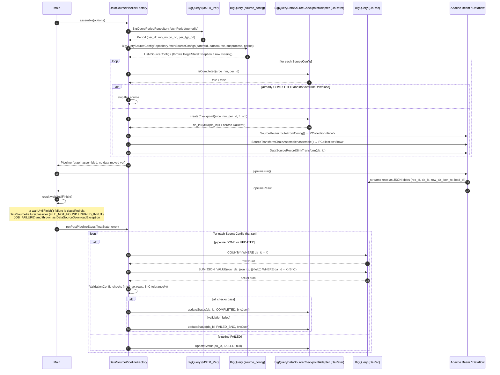
```mermaid
sequenceDiagram
    autonumber
    participant Main
    participant DSF as DataSourcePipelineFactory
    participant Per as BigQuery (MSTR_Per)
    participant BQCfg as BigQuery (source_config)
    participant Checkpoint as BigQueryDataSourceCheckpointAdapter (DaRefer)
    participant DaRec as BigQuery (DaRec)
    participant Beam as Apache Beam / Dataflow

    Main->>DSF: assemble(options)
    DSF->>Per: BigQueryPeriodRepository.fetchPeriod(periodId)
    Per-->>DSF: Period (per_dt, mo_no, yr_no, per_typ_cd)
    DSF->>BQCfg: BigQuerySourceConfigRepository.fetchSourceConfigs(parentId, datasource, subprocess, period)
    BQCfg-->>DSF: List<SourceConfig>  (throws IllegalStateException if row missing)

    loop for each SourceConfig
        DSF->>Checkpoint: isCompleted(srce_nm, per_id)
        Checkpoint-->>DSF: true / false
        alt already COMPLETED and not overrideDownload
            DSF->>DSF: skip this source
        else
            DSF->>Checkpoint: createCheckpoint(srce_nm, per_id, fl_nm)
            Checkpoint-->>DSF: da_id (MAX(da_id)+1 across DaRefer)
            DSF->>Beam: SourceRouter.routeFromConfig() → PCollection<Row>
            DSF->>Beam: SourceTransformChainAssembler.assemble() → PCollection<Row>
            DSF->>Beam: DataSourceRecordSinkTransform(da_id)
        end
    end

    DSF-->>Main: Pipeline (graph assembled, no data moved yet)

    Main->>Beam: pipeline.run()
    Beam->>DaRec: streams rows as JSON blobs (rec_id, da_id, row_da_json_tx, load_dt)
    Beam-->>Main: PipelineResult

    Main->>Main: result.waitUntilFinish()
    Note over Main: a waitUntilFinish() failure is classified via<br/>DataSourceFailureClassifier (FILE_NOT_FOUND / INVALID_INPUT /<br/>JOB_FAILURE) and thrown as DataSourceDownloadException
    Main->>DSF: runPostPipelineSteps(finalState, error)

    loop for each SourceConfig that ran
        alt pipeline DONE or UPDATED
            DSF->>DaRec: COUNT(*) WHERE da_id = X
            DaRec-->>DSF: rowCount
            DSF->>DaRec: SUM(JSON_VALUE(row_da_json_tx, @field)) WHERE da_id = X (BnC)
            DaRec-->>DSF: actual sum
            DSF->>DSF: ValidationConfig checks (min/max rows, BnC tolerance%)
            alt all checks pass
                DSF->>Checkpoint: updateStatus(da_id, COMPLETED, bncJson)
            else validation failed
                DSF->>Checkpoint: updateStatus(da_id, FAILED_BNC, bncJson)
            end
        else pipeline FAILED
            DSF->>Checkpoint: updateStatus(da_id, FAILED, null)
        end
    end
```

---

## 4. Per-Source Beam Branch

Each `SourceConfig` produces one independent branch of the Beam DAG. Branches are **never merged**.

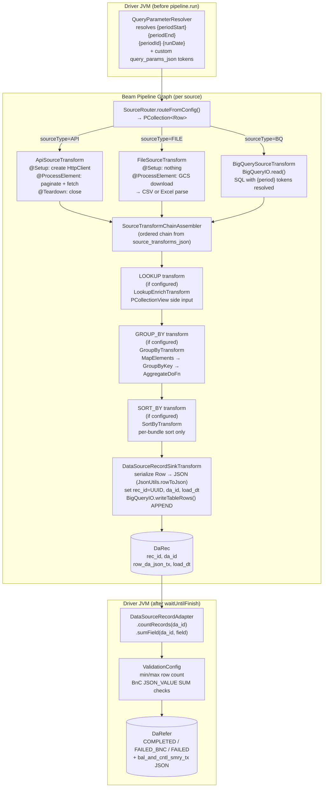
```mermaid
flowchart TD
    subgraph "Beam Pipeline Graph (per source)"
        direction TB
        A["SourceRouter.routeFromConfig()\n→ PCollection&lt;Row&gt;"]

        A -->|sourceType=API| B1["ApiSourceTransform\n@Setup: create HttpClient\n@ProcessElement: paginate + fetch\n@Teardown: close"]
        A -->|sourceType=FILE| B2["FileSourceTransform\n@Setup: nothing\n@ProcessElement: GCS download\n→ CSV or Excel parse"]
        A -->|sourceType=BQ| B3["BigQuerySourceTransform\nBigQueryIO.read()\nSQL with {period} tokens resolved"]

        B1 --> C["SourceTransformChainAssembler\n(ordered chain from source_transforms_json)"]
        B2 --> C
        B3 --> C

        C --> D1["LOOKUP transform\n(if configured)\nLookupEnrichTransform\nPCollectionView side input"]
        D1 --> D2["GROUP_BY transform\n(if configured)\nGroupByTransform\nMapElements → GroupByKey → AggregateDoFn"]
        D2 --> D3["SORT_BY transform\n(if configured)\nSortByTransform\nper-bundle sort only"]

        D3 --> F["DataSourceRecordSinkTransform\nserialize Row → JSON (JsonUtils.rowToJson)\nset rec_id=UUID, da_id, load_dt\nBigQueryIO.writeTableRows() APPEND"]
        F --> RecTab[("DaRec\nrec_id, da_id\nrow_da_json_tx, load_dt")]
    end

    subgraph "Driver JVM (before pipeline.run)"
        H["QueryParameterResolver\nresolves {periodStart} {periodEnd}\n{periodId} {runDate}\n+ custom query_params_json tokens"]
        H --> A
    end

    subgraph "Driver JVM (after waitUntilFinish)"
        RecTab --> I["DataSourceRecordAdapter\n.countRecords(da_id)\n.sumField(da_id, field)"]
        I --> J["ValidationConfig\nmin/max row count\nBnC JSON_VALUE SUM checks"]
        J --> K[("DaRefer\nCOMPLETED / FAILED_BNC / FAILED\n+ bal_and_cntl_smry_tx JSON")]
    end
```

---

## 5. SourceTransformChainAssembler — Lookup Loading Detail

Lookup views are built differently depending on the lookup source type.

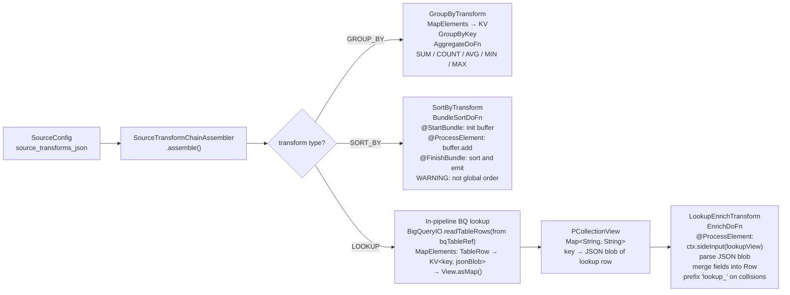
```mermaid
flowchart LR
    A["SourceConfig\nsource_transforms_json"] --> B["SourceTransformChainAssembler\n.assemble()"]

    B --> C{transform type?}

    C -->|GROUP_BY| D["GroupByTransform\nMapElements → KV<groupKey, Row>\nGroupByKey\nAggregateDoFn\nSUM / COUNT / AVG / MIN / MAX"]

    C -->|SORT_BY| E["SortByTransform\nBundleSortDoFn\n@StartBundle: init buffer\n@ProcessElement: buffer.add\n@FinishBundle: sort and emit\nWARNING: not global order"]

    C -->|LOOKUP| F["In-pipeline BQ lookup\nBigQueryIO.readTableRows(from bqTableRef)\nMapElements: TableRow → KV&lt;key, jsonBlob&gt;\n→ View.asMap()"]

    F --> I["PCollectionView\nMap&lt;String, String&gt;\nkey → JSON blob of lookup row"]

    I --> J["LookupEnrichTransform\nEnrichDoFn\n@ProcessElement:\nctx.sideInput(lookupView)\nparse JSON blob\nmerge fields into Row\nprefix 'lookup_' on collisions"]
```

---

## 6. REPORT_PROCESSING — Full Sequence

Report processing runs entirely in the **driver JVM** — no Dataflow job is submitted.
All configuration is loaded from **BigQuery** (no JDBC). Two config patterns coexist:
- **Nested JSON** (`parameter_store` via `BigQueryReportRepository`) — used by `ReportPipelineFactory`
- **Flat key-value** (`parameter_store` via `BigQueryParameterAdapter`) — used by `ExampleWorkflow`

Both read the same `parameter_store` table; they differ only in how `parameters_val_json` is structured.

### 6a. ReportPipelineFactory — parameter_store nested JSON config

```mermaid
sequenceDiagram
    autonumber
    participant Main
    participant RPF as ReportPipelineFactory
    participant BQRepo as BigQueryReportRepository
    participant CfgBQ as BigQuery<br/>(parameter_store)
    participant RptAdapter as BigQueryReportCheckpointAdapter<br/>(RptRefer / RptDaMap / RptStageDa / RptOutput)
    participant DsAdapter as BigQueryDataSourceCheckpointAdapter<br/>(DaRefer)
    participant BQJob as BigQueryJobService
    participant DataBQ as BigQuery<br/>(data / report tables)
    participant DaRec as BigQuery<br/>(DaRec)
    participant GCS as Cloud Storage
    participant EmailUtil as EmailSendUtility<br/>(SPI-discovered or injected)

    Main->>RPF: execute(options)

    rect rgb(230, 240, 255)
        Note over RPF,CfgBQ: Phase 1 — Config load
        RPF->>BQRepo: fetchReportConfig(reportName, subprocess, periodId)
        BQRepo->>CfgBQ: SELECT parameters_val_json FROM parameter_store<br/>WHERE parameter_group_name=parentId AND parameter_data_source=subprocess<br/>AND parameter_name=reportName
        CfgBQ-->>BQRepo: parameters_val_json (nested JSON blob)
        BQRepo-->>RPF: ReportConfig (parsed from JSON)
    end

    RPF->>RptAdapter: createCheckpoint(rptNm=reportName, perId, rptDs=reportName)
    RptAdapter-->>RPF: rpt_id (LOADING row inserted into RptRefer)

    rect rgb(255, 245, 220)
        Note over RPF,DataBQ: Phase 2 — Preprocessing (optional)
        opt hasPreprocessing
            loop each ReportPreprocessingStep (by step_order)
                RPF->>BQJob: runQueryToTable(resolvedSQL, bqOutputTable)
                BQJob->>DataBQ: CREATE QueryJob (WRITE_TRUNCATE)
            end
        end
    end

    rect rgb(255, 235, 235)
        Note over RPF,DsAdapter: Phase 3 — Datasource availability check
        loop each required ReportDatasourceRef
            RPF->>DsAdapter: isCompleted(srce_nm=datasourceName, per_id)
            DsAdapter->>DataBQ: SELECT sta_cd FROM DaRefer WHERE srce_nm=? AND per_id=? AND sta_cd='COMPLETED'
            DataBQ-->>DsAdapter: row or empty
            alt no COMPLETED row
                RPF->>RptAdapter: updateStatus(rpt_id, FAILED)
                RPF-->>Main: throws ReportProcessingException(DATASOURCE_UNAVAILABLE)
            end
        end
    end

    rect rgb(230, 255, 235)
        Note over RPF,DaRec: Phase 4 — Map datasources + stage data
        loop each ReportDatasourceRef
            RPF->>DsAdapter: fetchLatestCompletedDaId(datasourceName, periodId)
            DsAdapter-->>RPF: da_id
            RPF->>RptAdapter: addDaMapping(rpt_id, da_id)
            RptAdapter-->>RPF: map_id (row inserted into RptDaMap)
            RPF->>RptAdapter: stageFromDaRec(map_id, da_id)
            RptAdapter->>DaRec: INSERT INTO RptStageDa SELECT ... FROM DaRec WHERE da_id=? (page copy, one RptStageDa row per DaRec page)
            RPF->>RPF: aliasRegistry.put(alias, stagedDataSubquery(map_id)) — subquery un-nests RptStageDa's pages back into individual records
        end
    end

    rect rgb(240, 230, 255)
        Note over RPF,DataBQ: Phase 5 — Transformation chain
        loop each ReportTransformStep (by step_order)
            RPF->>RPF: resolveAliasTokens({alias} → RptStageDa subquery or prior output table)
            RPF->>BQJob: runQueryToTable(resolvedSQL, step.outputBqTable)
            BQJob->>DataBQ: CREATE QueryJob → materialise to outputBqTable
            RPF->>RPF: aliasRegistry.put(step.outputAlias, step.outputBqTable)
        end
    end

    rect rgb(255, 250, 220)
        Note over RPF,GCS: Phase 6 — Export outputs
        loop each ReportOutputConfig (by output_order)
            RPF->>RPF: aliasRegistry.get(inputAlias) → sourceTable
            alt outputFormat = CSV
                RPF->>BQJob: exportToCsv(sourceTable, gcsUri, includeHeader)
                BQJob->>GCS: write CSV file
            else outputFormat = JSON
                RPF->>BQJob: exportToJson(sourceTable, gcsUri)
                BQJob->>GCS: write JSON file
            end
        end
    end

    rect rgb(255, 235, 210)
        Note over RPF,RptAdapter: Phase 7 — Write RptOutput + clear staged data
        loop each ReportOutputConfig
            RPF->>RptAdapter: writeOutput(rpt_id, outptCd, outputDs, lineReferCd, schedTx, balAm, rptTypeCd)
            RptAdapter->>DataBQ: INSERT INTO RptOutput (vsn_no = MAX(vsn_no)+1)
        end
        RPF->>RptAdapter: clearStagedData(rpt_id)
        RptAdapter->>DataBQ: DELETE FROM RptStageDa WHERE map_id IN (SELECT map_id FROM RptDaMap WHERE rpt_id=?)
    end

    rect rgb(220, 245, 255)
        Note over RPF,EmailUtil: Phase 8 — Email (optional; skipped with a warning if no EmailSendUtility is available)
        opt hasEmail and emailUtility != null
            loop each exported GCS file
                RPF->>EmailUtil: FetchFileFromGcs(gcsUri)
                EmailUtil->>GCS: read object
                GCS-->>EmailUtil: bytes
                EmailUtil-->>RPF: InputStream (wrapped as model.EmailAttachment)
            end
            RPF->>EmailUtil: SetEmailParams(fromAddress, subject, toList, ccList, encrypted)
            EmailUtil-->>RPF: EmailParams
            RPF->>EmailUtil: CreateEmailRequest(emailParams, body, attachments)
        end
    end

    RPF->>RptAdapter: updateStatus(rpt_id, COMPLETED) or updateStatus(rpt_id, FAILED)
```

### 6b. ExampleWorkflow — key-value BigQueryParameterAdapter pattern

An alternative to the 6-table structured config. All job config lives as key-value rows
in `parameter_store`. The framework discovers which keys are needed from `required_parameters_index`
at runtime — no key names are hard-coded in Java.

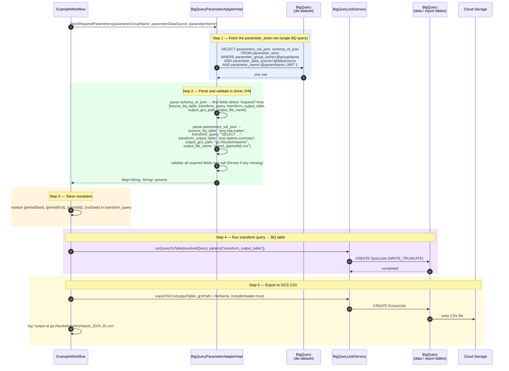
```mermaid
sequenceDiagram
    autonumber
    participant EW as ExampleWorkflow
    participant Adapter as BigQueryParameterAdapterImpl
    participant CfgBQ as BigQuery<br/>(dw dataset)
    participant BQJob as BigQueryJobService
    participant DataBQ as BigQuery<br/>(data / report tables)
    participant GCS as Cloud Storage

    EW->>Adapter: fetchRequiredParameters(parameterGroupName, parameterDataSource, parameterName)

    rect rgb(230, 240, 255)
        Note over Adapter,CfgBQ: Step 1 — Fetch the parameter_store row (single BQ query)
        Adapter->>CfgBQ: SELECT parameters_val_json, schema_of_json<br/>FROM parameter_store<br/>WHERE parameter_group_name=@groupName<br/>AND parameter_data_source=@dataSource<br/>AND parameter_name=@paramName LIMIT 1
        CfgBQ-->>Adapter: one row
    end

    rect rgb(230, 255, 235)
        Note over Adapter,Adapter: Step 2 — Parse and validate in driver JVM
        Adapter->>Adapter: parse schema_of_json → find fields where "required"=true<br/>[source_bq_table, transform_query, transform_output_table,<br/>output_gcs_path, output_file_name]
        Adapter->>Adapter: parse parameters_val_json →<br/>{source_bq_table: "proj.raw.trades",<br/>transform_query: "SELECT ...",<br/>transform_output_table: "proj.reports.summary",<br/>output_gcs_path: "gs://bucket/reports/",<br/>output_file_name: "report_{periodId}.csv"}
        Adapter->>Adapter: validate all required fields non-null (throws if any missing)
        Adapter-->>EW: Map<String, String> params
    end

    rect rgb(255, 245, 220)
        Note over EW,EW: Step 3 — Token resolution
        EW->>EW: replace {periodStart}, {periodEnd}, {periodId}, {runDate} in transform_query
    end

    rect rgb(240, 230, 255)
        Note over EW,DataBQ: Step 4 — Run transform query → BQ table
        EW->>BQJob: runQueryToTable(resolvedQuery, params["transform_output_table"])
        BQJob->>DataBQ: CREATE QueryJob (WRITE_TRUNCATE)
        DataBQ-->>BQJob: completed
    end

    rect rgb(255, 250, 220)
        Note over EW,GCS: Step 5 — Export to GCS CSV
        EW->>BQJob: exportToCsv(outputTable, gcsPath + fileName, includeHeader=true)
        BQJob->>DataBQ: CREATE ExtractJob
        DataBQ->>GCS: write CSV file
        EW->>EW: log "output at gs://bucket/reports/report_2024_01.csv"
    end
```

---

## 7. Query Token Resolution — Three Layers

Every SQL template in the framework goes through up to three resolution passes.

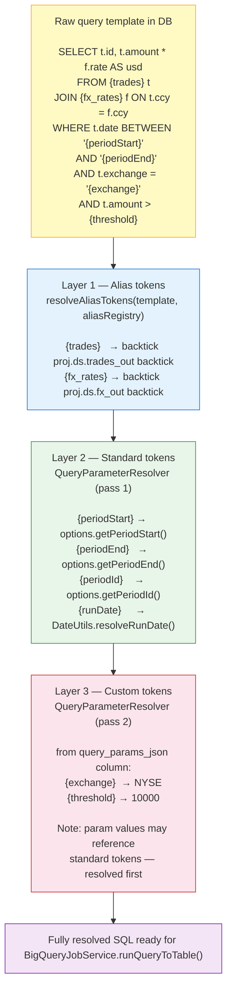
```mermaid
flowchart TD
    A["Raw query template in DB\n\nSELECT t.id, t.amount * f.rate AS usd\nFROM {trades} t\nJOIN {fx_rates} f ON t.ccy = f.ccy\nWHERE t.date BETWEEN '{periodStart}'\n  AND '{periodEnd}'\n  AND t.exchange = '{exchange}'\n  AND t.amount > {threshold}"]

    A --> B["Layer 1 — Alias tokens\nresolveAliasTokens(template, aliasRegistry)\n\n{trades}   → backtick proj.ds.trades_out backtick\n{fx_rates} → backtick proj.ds.fx_out backtick"]

    B --> C["Layer 2 — Standard tokens\nQueryParameterResolver (pass 1)\n\n{periodStart} → options.getPeriodStart()\n{periodEnd}   → options.getPeriodEnd()\n{periodId}    → options.getPeriodId()\n{runDate}     → DateUtils.resolveRunDate()"]

    C --> D["Layer 3 — Custom tokens\nQueryParameterResolver (pass 2)\n\nfrom query_params_json column:\n{exchange}  → NYSE\n{threshold} → 10000\n\nNote: param values may reference\nstandard tokens — resolved first"]

    D --> E["Fully resolved SQL ready for BigQueryJobService.runQueryToTable()"]

    style A fill:#fff9c4,stroke:#F9A825
    style B fill:#e3f2fd,stroke:#1976D2
    style C fill:#e8f5e9,stroke:#388E3C
    style D fill:#fce4ec,stroke:#C62828
    style E fill:#f3e5f5,stroke:#7B1FA2
```

---

## 8. Checkpoint State Machines

### DaRefer — DATA_SOURCE_DOWNLOAD

`DATA_SOURCE_DOWNLOAD` writes one `DaRefer` row per source per run.

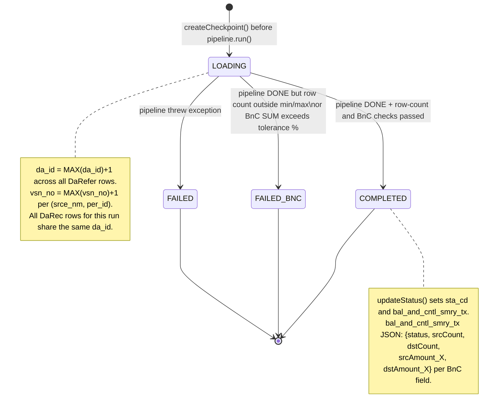
```mermaid
stateDiagram-v2
    [*] --> LOADING : createCheckpoint() before pipeline.run()

    LOADING --> COMPLETED : pipeline DONE + row-count and BnC checks passed

    LOADING --> FAILED_BNC : pipeline DONE but row count outside min/max\nor BnC SUM exceeds tolerance %

    LOADING --> FAILED : pipeline threw exception

    COMPLETED --> [*]
    FAILED_BNC --> [*]
    FAILED --> [*]

    note right of LOADING
        da_id = MAX(da_id)+1 across all DaRefer rows.
        vsn_no = MAX(vsn_no)+1 per (srce_nm, per_id).
        All DaRec rows for this run share the same da_id.
    end note

    note right of COMPLETED
        updateStatus() sets sta_cd and bal_and_cntl_smry_tx.
        bal_and_cntl_smry_tx JSON: {status, srcCount, dstCount,
        srcAmount_X, dstAmount_X} per BnC field.
    end note
```

### RptRefer — REPORT_PROCESSING

`REPORT_PROCESSING` writes one `RptRefer` row per report run.

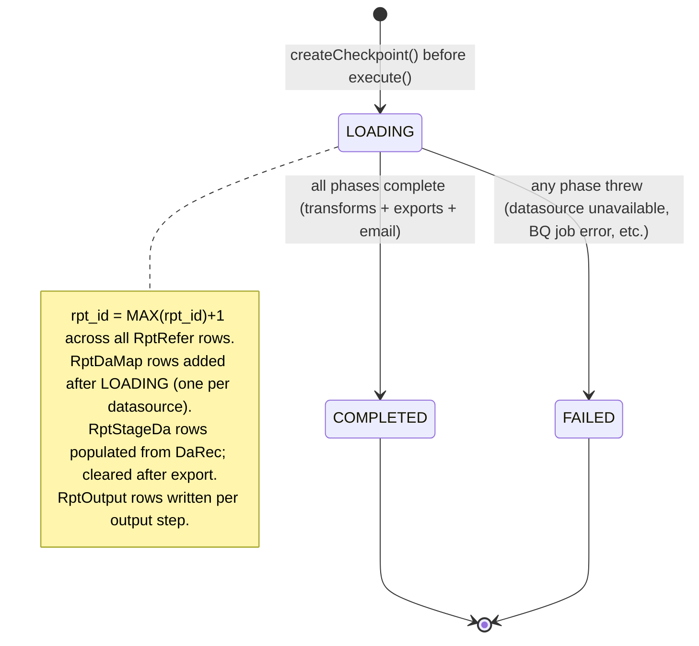
```mermaid
stateDiagram-v2
    [*] --> LOADING : createCheckpoint() before execute()

    LOADING --> COMPLETED : all phases complete (transforms + exports + email)

    LOADING --> FAILED : any phase threw (datasource unavailable, BQ job error, etc.)

    COMPLETED --> [*]
    FAILED --> [*]

    note right of LOADING
        rpt_id = MAX(rpt_id)+1 across all RptRefer rows.
        RptDaMap rows added after LOADING (one per datasource).
        RptStageDa rows populated from DaRec; cleared after export.
        RptOutput rows written per output step.
    end note
```

---

## 9. Key Model Relationships

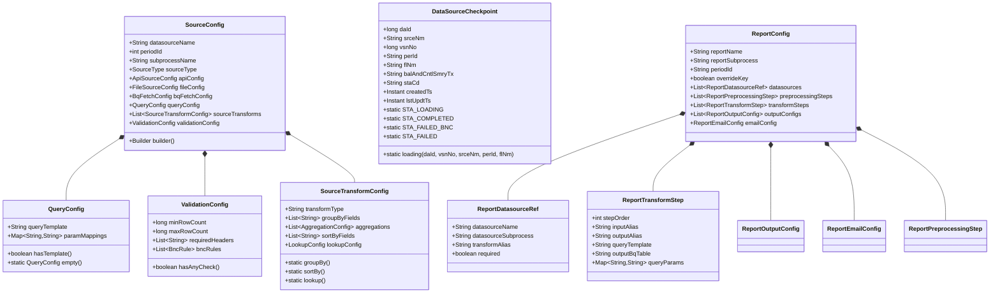
```mermaid
classDiagram
    class SourceConfig {
        +String datasourceName
        +int periodId
        +String subprocessName
        +SourceType sourceType
        +ApiSourceConfig apiConfig
        +FileSourceConfig fileConfig
        +BqFetchConfig bqFetchConfig
        +QueryConfig queryConfig
        +List~SourceTransformConfig~ sourceTransforms
        +ValidationConfig validationConfig
        +Builder builder()
    }

    class QueryConfig {
        +String queryTemplate
        +Map~String,String~ paramMappings
        +boolean hasTemplate()
        +static QueryConfig empty()
    }

    class SourceTransformConfig {
        +String transformType
        +List~String~ groupByFields
        +List~AggregationConfig~ aggregations
        +List~String~ sortByFields
        +LookupConfig lookupConfig
        +static groupBy()
        +static sortBy()
        +static lookup()
    }

    class ValidationConfig {
        +long minRowCount
        +long maxRowCount
        +List~String~ requiredHeaders
        +List~BncRule~ bncRules
        +boolean hasAnyCheck()
    }

    class DataSourceCheckpoint {
        +long daId
        +String srceNm
        +long vsnNo
        +String perId
        +String flNm
        +String balAndCntlSmryTx
        +String staCd
        +Instant createdTs
        +Instant lstUpdtTs
        +static STA_LOADING
        +static STA_COMPLETED
        +static STA_FAILED_BNC
        +static STA_FAILED
        +static loading(daId, vsnNo, srceNm, perId, flNm)
    }

    class ReportConfig {
        +String reportName
        +String reportSubprocess
        +String periodId
        +boolean overrideKey
        +List~ReportDatasourceRef~ datasources
        +List~ReportPreprocessingStep~ preprocessingSteps
        +List~ReportTransformStep~ transformSteps
        +List~ReportOutputConfig~ outputConfigs
        +ReportEmailConfig emailConfig
    }

    class ReportTransformStep {
        +int stepOrder
        +String inputAlias
        +String outputAlias
        +String queryTemplate
        +String outputBqTable
        +Map~String,String~ queryParams
    }

    class ReportDatasourceRef {
        +String datasourceName
        +String datasourceSubprocess
        +String transformAlias
        +boolean required
    }

    SourceConfig *-- QueryConfig
    SourceConfig *-- ValidationConfig
    SourceConfig *-- SourceTransformConfig
    ReportConfig *-- ReportDatasourceRef
    ReportConfig *-- ReportTransformStep
    ReportConfig *-- ReportOutputConfig
    ReportConfig *-- ReportEmailConfig
    ReportConfig *-- ReportPreprocessingStep
```

---

## 10. BigQuery Config Tables — Entity Relationship

All configuration lives in BigQuery (`--paramBqProject.--paramBqDataset`). No JDBC.
A single `parameter_store` table holds all configuration for both pipeline types:

- **Source configs** (DATA_SOURCE_DOWNLOAD) — flat JSON in `parameters_val_json`, read by `BigQuerySourceConfigRepository`
- **Report configs** (REPORT_PROCESSING) — nested JSON blob in `parameters_val_json`, read by `BigQueryReportRepository`

The lookup key is always `(parameter_group_name, parameter_data_source, parameter_name)`.
`periodId` is never a lookup key — configs are period-agnostic.

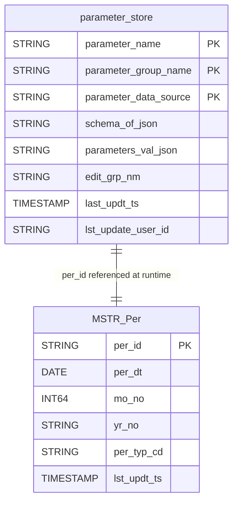
```mermaid
erDiagram
    parameter_store {
        STRING parameter_name PK
        STRING parameter_group_name PK
        STRING parameter_data_source PK
        STRING schema_of_json
        STRING parameters_val_json
        STRING edit_grp_nm
        TIMESTAMP last_updt_ts
        STRING lst_update_user_id
    }

    MSTR_Per {
        STRING per_id PK
        DATE per_dt
        INT64 mo_no
        STRING yr_no
        STRING per_typ_cd
        TIMESTAMP lst_updt_ts
    }

    parameter_store ||--|| MSTR_Per : "per_id referenced at runtime"
```

### parameters_val_json: source config (flat JSON)
```json
{"source_type": "BQ", "bq_query": "SELECT ...", "min_row_count": "1", ...}
```

### parameters_val_json: report config (nested JSON)
```json
{
  "override_key": false,
  "datasources":  [{"datasource_name": "trades", "transform_alias": "raw_trades", "is_required": true, ...}],
  "preprocessing": [],
  "transforms":   [{"step_order": 1, "input_alias": "raw_trades", "output_alias": "summary", "query_template": "...", ...}],
  "outputs":      [{"output_order": 1, "input_alias": "summary", "sink_type": "GCS", "output_format": "CSV", ...}],
  "email":        {"to_list": ["analyst@example.com"], "subject_template": "Report {periodId}", ...}
}
```

---

## 11. BigQuery Tables — Runtime State

These tables are written at runtime (in `--checkpointBqDataset`, default `pipeline_metadata`).
`DATA_SOURCE_DOWNLOAD` uses `DaRefer` + `DaRec`. `REPORT_PROCESSING` uses `DaRefer` (read-only, availability check) + `RptRefer` / `RptDaMap` / `RptStageDa` / `RptOutput`.

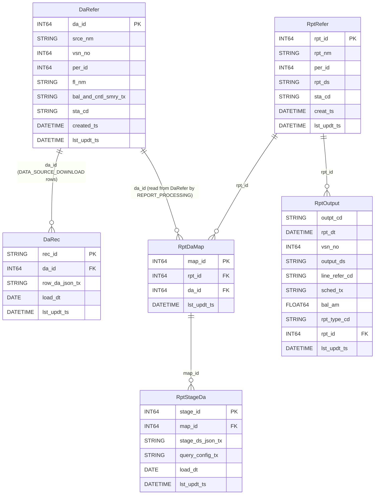
```mermaid
erDiagram
    DaRefer {
        INT64 da_id PK
        STRING srce_nm
        INT64 vsn_no
        INT64 per_id
        STRING fl_nm
        STRING bal_and_cntl_smry_tx
        STRING sta_cd
        DATETIME created_ts
        DATETIME lst_updt_ts
    }

    DaRec {
        STRING rec_id PK
        INT64 da_id FK
        STRING row_da_json_tx
        DATE load_dt
        DATETIME lst_updt_ts
    }

    RptRefer {
        INT64 rpt_id PK
        STRING rpt_nm
        INT64 per_id
        STRING rpt_ds
        STRING sta_cd
        DATETIME creat_ts
        DATETIME lst_updt_ts
    }

    RptDaMap {
        INT64 map_id PK
        INT64 rpt_id FK
        INT64 da_id FK
        DATETIME lst_updt_ts
    }

    RptStageDa {
        INT64 stage_id PK
        INT64 map_id FK
        STRING stage_ds_json_tx
        STRING query_config_tx
        DATE load_dt
        DATETIME lst_updt_ts
    }

    RptOutput {
        STRING outpt_cd
        DATETIME rpt_dt
        INT64 vsn_no
        STRING output_ds
        STRING line_refer_cd
        STRING sched_tx
        FLOAT64 bal_am
        STRING rpt_type_cd
        INT64 rpt_id FK
        DATETIME lst_updt_ts
    }

    DaRefer ||--o{ DaRec : "da_id (DATA_SOURCE_DOWNLOAD rows)"
    RptRefer ||--o{ RptDaMap : "rpt_id"
    RptDaMap ||--o{ RptStageDa : "map_id"
    RptRefer ||--o{ RptOutput : "rpt_id"
    DaRefer ||--o{ RptDaMap : "da_id (read from DaRefer by REPORT_PROCESSING)"
```

**DaRefer** — `sta_cd` values: `LOADING` | `COMPLETED` | `FAILED_BNC` | `FAILED`. Written by `DATA_SOURCE_DOWNLOAD` only; read by `REPORT_PROCESSING` to check datasource availability.

`vsn_no` increments each time the same `(srce_nm, per_id)` is re-run.

`bal_and_cntl_smry_tx` (BnC summary JSON, DATA_SOURCE_DOWNLOAD only):
```json
{ "status": "Matched", "srcCount": 1000, "srcAmount": 5000000.00, "dstCount": 1000, "dstAmount": 5000000.00 }
```

**RptRefer** — `sta_cd` values: `LOADING` | `COMPLETED` | `FAILED`. Written and updated by `REPORT_PROCESSING` only.

**RptStageDa** — transient. Rows are copied from `DaRec` before the transform chain runs and deleted after all outputs are exported. They exist only for the duration of one report execution. Batched like `DaRec`: one `RptStageDa` row per `DaRec` page (≤250 records), not one row per source record — `stagedDataSubquery()` un-nests those pages back into individual records when a transform's `{alias}` resolves, so this batching is invisible to every `query_template`.

---

## 12. Email — Two Separate Contracts, Two Different Callers


```mermaid
classDiagram
    class ReportEmailAdapter {
        <<interface>>
        +send(subject, body, to, cc, attachments) void
    }

    class SmtpReportEmailAdapter {
        -Session session
        -String fromAddress
        +SmtpReportEmailAdapter(String smtpHost, int smtpPort, String smtpPasswordSecretId, String fromAddress)
        +send(subject, body, to, cc, attachments) void
    }

    class IoEmailAttachment["EmailAttachment (io/email)"] {
        +InputStream content
        +String fileName
        +String contentType
        +static csv(content, fileName) EmailAttachment
        +static json(content, fileName) EmailAttachment
    }

    class SideEffectEmailTransform {
        <<Beam PTransform>>
        note "Used inside the pipeline for\nper-row email notifications\nNo attachments"
    }

    ReportEmailAdapter <|.. SmtpReportEmailAdapter : implements
    SmtpReportEmailAdapter ..> IoEmailAttachment : uses
    ReportEmailAdapter ..> IoEmailAttachment : parameter

    note for SmtpReportEmailAdapter "Constructor args come straight from\nSourceFailureEmailConfig — used only by\nPostDownloadFinalizeTransform's\nDATA_SOURCE_DOWNLOAD failure email.\nFetches password from Secret Manager.\nUses jakarta.mail MimeMultipart\nfor file attachments."

    class EmailSendUtility {
        <<interface>>
        +SetEmailParams(fromAddress, subject, toList, ccList, encryptedOrNot) EmailParams
        +CreateEmailRequest(EmailParams, emailBodyHtml, emailAttachments) void
        +FetchFileFromGcs(fileLocation) InputStream
    }

    class EmailParams {
        +String fromEmailAddress
        +String subject
        +List~String~ toList
        +List~String~ ccList
        +boolean encryptedOrNot
    }

    class ModelEmailAttachment["EmailAttachment (model)"] {
        +String fileName
        +InputStream content
        +String type
    }

    EmailSendUtility ..> EmailParams : returns / consumes
    EmailSendUtility ..> ModelEmailAttachment : parameter

    note for EmailSendUtility "No implementation ships in this repo.\nReportPipelineFactory discovers one via\nServiceLoader SPI, or accepts one via\nconstructor injection. Used only for\nREPORT_PROCESSING/PIPELINE\nreport-completion email — if none is\navailable, sending is skipped with a\nwarning, not a failure."
```

`ReportEmailAdapter`/`SmtpReportEmailAdapter` and `EmailSendUtility` are unrelated interfaces for
two different callers — `ReportPipelineFactory` no longer touches `SmtpReportEmailAdapter` at
all (its one call site there had a real constructor-signature bug and has been replaced).

---

## 13. DATA_SOURCE_DOWNLOAD — Airflow Configuration Example

```python
# Airflow DAG: download trades data for a monthly period
DataflowStartJobOperator(
    task_id="download_trades",
    jar="gs://bucket/jars/beam-runner-bundled.jar",
    options={
        "--processType":         "DATA_SOURCE_DOWNLOAD",
        "--parentId":            "TRADING",      # → parent_id in source_config
        "--datasourceName":      "trades",
        "--subprocessName":      "eod",
        "--periodId":            "202401",        # integer period id, e.g. YYYYMM or YYYYMMDD
        "--periodStart":         "2024-01-01",
        "--periodEnd":           "2024-01-31",
        "--runDate":             "{{ ds }}",
        "--paramBqProject":      "my-gcp-project",
        "--paramBqDataset":      "dw",
        "--checkpointBqProject": "my-gcp-project",
        "--checkpointBqDataset": "pipeline_metadata",
        "--daReferTable":        "DaRefer",
        "--daRecTable":          "DaRec",
    }
)
```

---

## 14. REPORT_PROCESSING — Airflow Configuration Example

```python
# Airflow DAG: generate daily trades report (runs after download completes)
DataflowStartJobOperator(
    task_id="run_trades_report",
    jar="gs://bucket/jars/beam-runner-bundled.jar",
    options={
        "--processType":         "REPORT_PROCESSING",
        "--parentId":            "TRADING",      # → parameter_group_name in parameter_store
        "--reportName":          "daily_trades_summary",
        "--reportSubprocess":    "eod",
        "--periodId":            "202401",        # integer period id, e.g. YYYYMM or YYYYMMDD
        "--periodStart":         "2024-01-01",
        "--periodEnd":           "2024-01-31",
        "--runDate":             "{{ ds }}",
        "--paramBqProject":      "my-gcp-project",
        "--paramBqDataset":      "dw",
        "--checkpointBqProject": "my-gcp-project",
        "--checkpointBqDataset": "pipeline_metadata",
        "--daReferTable":        "DaRefer",
        "--daRecTable":          "DaRec",
        "--rptReferTable":       "RptRefer",
        "--rptDaMapTable":       "RptDaMap",
        "--rptStageDaTable":     "RptStageDa",
        "--rptOutputTable":      "RptOutput",
        "--emailSmtpHost":       "smtp.gmail.com",
        "--emailSmtpPort":       "587",
        "--smtpPasswordSecretId": "projects/p/secrets/smtp-password/versions/latest",
        "--devErrorEmail":       "reports@company.com",
        # --sinkType / --sourceType / --transformChain are NOT used here;
        # all output routing comes from parameter_store outputs[].sink_type (GCS | BQ | API)
    }
)
```

> **Note**: When `--reportName` is set, `--sinkType`, `--sourceType`, and `--transformChain` are not used.
> All config (including output sink type per output step) is loaded from BigQuery.

---

## 15. Code Navigation Map

Where to find things in the source tree:

| Concept | File |
|---|---|
| All CLI flags | [`beam-core/.../options/FrameworkOptions.java`](beam-core/src/main/java/com/yourco/beam/options/FrameworkOptions.java) |
| Entry point | [`beam-runner/.../runner/Main.java`](beam-runner/src/main/java/com/yourco/beam/runner/Main.java) |
| DATA_SOURCE_DOWNLOAD orchestration | [`beam-runner/.../runner/DataSourcePipelineFactory.java`](beam-runner/src/main/java/com/yourco/beam/runner/DataSourcePipelineFactory.java) |
| REPORT_PROCESSING orchestration | [`beam-runner/.../runner/ReportPipelineFactory.java`](beam-runner/src/main/java/com/yourco/beam/runner/ReportPipelineFactory.java) |
| PIPELINE orchestration (composes the two above, reuses ReportConfig.datasources[]) | [`beam-runner/.../runner/PipelineSequenceFactory.java`](beam-runner/src/main/java/com/yourco/beam/runner/PipelineSequenceFactory.java) |
| Source routing | [`beam-io/.../io/source/SourceRouter.java`](beam-io/src/main/java/com/yourco/beam/io/source/SourceRouter.java) |
| Per-source transform chain | [`beam-runner/.../runner/SourceTransformChainAssembler.java`](beam-runner/src/main/java/com/yourco/beam/runner/SourceTransformChainAssembler.java) |
| Lookup transform (side input) | [`beam-transforms/.../transforms/source/LookupEnrichTransform.java`](beam-transforms/src/main/java/com/yourco/beam/transforms/source/LookupEnrichTransform.java) |
| Group-by transform | [`beam-transforms/.../transforms/source/GroupByTransform.java`](beam-transforms/src/main/java/com/yourco/beam/transforms/source/GroupByTransform.java) |
| Query token resolution | [`beam-utils/.../utils/QueryParameterResolver.java`](beam-utils/src/main/java/com/yourco/beam/utils/QueryParameterResolver.java) |
| Source config loading (DATA_SOURCE_DOWNLOAD, BQ) | [`beam-io/.../io/config/BigQuerySourceConfigRepository.java`](beam-io/src/main/java/com/yourco/beam/io/config/BigQuerySourceConfigRepository.java) |
| Report config loading (REPORT_PROCESSING, BQ) | [`beam-io/.../io/config/BigQueryReportRepository.java`](beam-io/src/main/java/com/yourco/beam/io/config/BigQueryReportRepository.java) |
| Key-value BQ parameter store | [`beam-io/.../io/params/BigQueryParameterAdapter.java`](beam-io/src/main/java/com/yourco/beam/io/params/BigQueryParameterAdapter.java) |
| BQ job execution | [`beam-io/.../io/report/BigQueryJobService.java`](beam-io/src/main/java/com/yourco/beam/io/report/BigQueryJobService.java) |
| End-to-end BQ param example | [`beam-runner/.../runner/example/ExampleWorkflow.java`](beam-runner/src/main/java/com/yourco/beam/runner/example/ExampleWorkflow.java) |
| Checkpoint lifecycle (LOADING→COMPLETED/FAILED) | [`beam-io/.../io/checkpoint/BigQueryDataSourceCheckpointAdapter.java`](beam-io/src/main/java/com/yourco/beam/io/checkpoint/BigQueryDataSourceCheckpointAdapter.java) |
| Record table sink (all sources → JSON blobs) | [`beam-io/.../io/sink/DataSourceRecordSinkTransform.java`](beam-io/src/main/java/com/yourco/beam/io/sink/DataSourceRecordSinkTransform.java) |
| Record validation (BnC via JSON_VALUE) | [`beam-io/.../io/records/BigQueryDataSourceRecordAdapter.java`](beam-io/src/main/java/com/yourco/beam/io/records/BigQueryDataSourceRecordAdapter.java) |
| Email interface (DATA_SOURCE_DOWNLOAD failure email) | [`beam-io/.../io/email/ReportEmailAdapter.java`](beam-io/src/main/java/com/yourco/beam/io/email/ReportEmailAdapter.java) |
| Email SMTP implementation | [`beam-runner/.../runner/SmtpReportEmailAdapter.java`](beam-runner/src/main/java/com/yourco/beam/runner/SmtpReportEmailAdapter.java) |
| Email interface (REPORT_PROCESSING/PIPELINE completion email) | [`beam-io/.../io/email/EmailSendUtility.java`](beam-io/src/main/java/com/yourco/beam/io/email/EmailSendUtility.java) |
| Exception hierarchy (one per process type) | [`beam-core/.../exception/`](beam-core/src/main/java/com/yourco/beam/exception/) |
| Failure notification entry point | [`beam-runner/.../runner/FailureNotifier.java`](beam-runner/src/main/java/com/yourco/beam/runner/FailureNotifier.java) |

---

## 16. PIPELINE — Run a Report's Own Required Data Sources First

Composes section 3 (`DATA_SOURCE_DOWNLOAD`) and section 6 (`REPORT_PROCESSING`) rather than
re-implementing either. There is no separate pipeline config: `PipelineSequenceFactory` takes the
exact same `--reportName`/`--reportSubprocess` as `REPORT_PROCESSING`, reads that report's own
`ReportConfig.datasources[]` (already declaring which datasources feed it and which are
mandatory via `is_required`), runs whichever aren't `COMPLETED`, and only then runs the report.

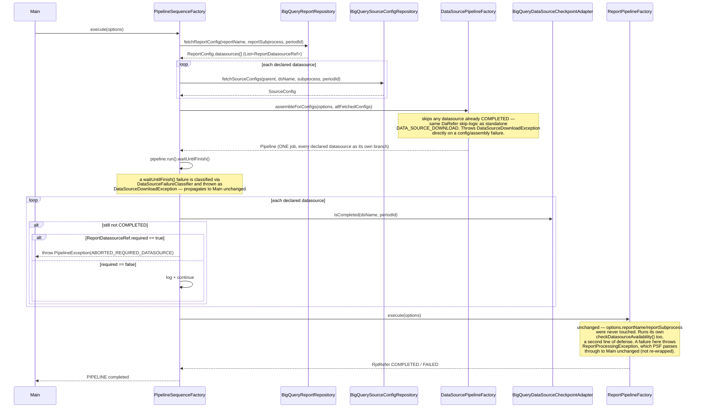
```mermaid
sequenceDiagram
    participant Main
    participant PSF as PipelineSequenceFactory
    participant RR as BigQueryReportRepository
    participant SCR as BigQuerySourceConfigRepository
    participant DSF as DataSourcePipelineFactory
    participant CKA as BigQueryDataSourceCheckpointAdapter
    participant RPF as ReportPipelineFactory

    Main->>PSF: execute(options)
    PSF->>RR: fetchReportConfig(reportName, reportSubprocess, periodId)
    RR-->>PSF: ReportConfig.datasources[] (List<ReportDatasourceRef>)

    loop each declared datasource
        PSF->>SCR: fetchSourceConfigs(parent, dsName, subprocess, periodId)
        SCR-->>PSF: SourceConfig
    end

    PSF->>DSF: assembleForConfigs(options, allFetchedConfigs)
    Note over DSF: skips any datasource already COMPLETED —<br/>same DaRefer skip-logic as standalone<br/>DATA_SOURCE_DOWNLOAD. Throws DataSourceDownloadException<br/>directly on a config/assembly failure.
    DSF-->>PSF: Pipeline (ONE job, every declared datasource as its own branch)
    PSF->>PSF: pipeline.run().waitUntilFinish()
    Note over PSF: a waitUntilFinish() failure is classified via<br/>DataSourceFailureClassifier and thrown as<br/>DataSourceDownloadException — propagates to Main unchanged

    loop each declared datasource
        PSF->>CKA: isCompleted(dsName, periodId)
        alt still not COMPLETED
            alt ReportDatasourceRef.required == true
                PSF-->>Main: throw PipelineException(ABORTED_REQUIRED_DATASOURCE)
            else required == false
                PSF->>PSF: log + continue
            end
        end
    end

    PSF->>RPF: execute(options)
    Note over RPF: unchanged — options.reportName/reportSubprocess<br/>were never touched. Runs its own<br/>checkDatasourceAvailability() too,<br/>a second line of defense. A failure here throws<br/>ReportProcessingException, which PSF passes<br/>through to Main unchanged (not re-wrapped).
    RPF-->>PSF: RptRefer COMPLETED / FAILED
    PSF-->>Main: PIPELINE completed
```

**Why no separate required/optional flag anywhere else**: the terminal report already declares
required datasources via `ReportDatasourceRef.required`, enforced on every report run
(`ReportPipelineFactory.checkDatasourceAvailability()`) whether reached via `PIPELINE` or
standalone `REPORT_PROCESSING`. A second, independently-set flag anywhere in a pipeline-specific
config could disagree with the first about the same datasource — there is exactly one place "is
this datasource required" is declared, and `PipelineSequenceFactory` reads it directly rather
than duplicating it.

**Why one batched job instead of one job per datasource**: sources are independent Beam branches
— the "never merged" rule from section 4 still holds, no `Flatten.pCollections()` across sources
— so submitting every declared datasource as one Dataflow job is just `DataSourcePipelineFactory`'s
existing multi-source behavior (`assembleForConfigs`), reused rather than reinvented.

---

## 17. Exception Hierarchy — Class Structure


```mermaid
classDiagram
    class DataSourceDownloadException {
        <<RuntimeException>>
        +Reason reason
        +String datasourceName
        +String subprocessName
        +int periodId
        +static wrap(reason, datasourceName, subprocessName, periodId, cause) DataSourceDownloadException
    }
    class DataSourceDownloadException_Reason["Reason"] {
        <<enumeration>>
        FILE_NOT_FOUND
        INVALID_INPUT
        CONNECTIVITY_FAILURE
        JOB_FAILURE
        UNKNOWN
    }

    class ReportProcessingException {
        <<RuntimeException>>
        +Reason reason
        +String reportName
        +String reportSubprocess
        +int periodId
        +static wrap(reason, reportName, reportSubprocess, periodId, cause) ReportProcessingException
    }
    class ReportProcessingException_Reason["Reason"] {
        <<enumeration>>
        CONFIG_NOT_FOUND
        PREPROCESSING_FAILURE
        DATASOURCE_UNAVAILABLE
        STAGING_FAILURE
        TRANSFORM_FAILURE
        OUTPUT_FAILURE
        EMAIL_FAILURE
        UNKNOWN
    }

    class PipelineException {
        <<RuntimeException>>
        +Reason reason
        +String reportName
        +String reportSubprocess
        +int periodId
        +static wrap(reason, reportName, reportSubprocess, periodId, cause) PipelineException
    }
    class PipelineException_Reason["Reason"] {
        <<enumeration>>
        CONFIGURATION_ERROR
        CONFIG_NOT_FOUND
        ABORTED_REQUIRED_DATASOURCE
        DATASOURCE_PHASE_FAILURE
        REPORT_PHASE_FAILURE
        UNKNOWN
    }

    DataSourceDownloadException *-- DataSourceDownloadException_Reason
    ReportProcessingException *-- ReportProcessingException_Reason
    PipelineException *-- PipelineException_Reason

    class DataSourceFailureClassifier {
        <<beam-runner, package-private>>
        +static classify(Throwable) DataSourceDownloadException.Reason
        note "Walks the cause chain for a\nFileSourceAdapter.FileSourceException\nor IllegalArgumentException — lives\nhere, not on the exception class,\nbecause beam-core can't import\nFileSourceAdapter (beam-io)."
    }

    class FailureNotifier {
        <<beam-runner, package-private>>
        +static notify(options, Throwable) void
        note "Main's single failure-notification\nentry point. Template by exception\ntype, plus a default for anything\nelse. Always logs; emails only if\n--opsFailureEmail is set and an\nEmailSendUtility is available."
    }

    DataSourceFailureClassifier ..> DataSourceDownloadException : classifies for
    FailureNotifier ..> DataSourceDownloadException : templates
    FailureNotifier ..> ReportProcessingException : templates
    FailureNotifier ..> PipelineException : templates
```

**Thrown from:**

| Exception | Factory | Mechanism |
|---|---|---|
| `DataSourceDownloadException` | `DataSourcePipelineFactory.assemble()`/`assembleForConfigs()` | direct try/catch around config load and graph assembly |
| `DataSourceDownloadException` | `Main.runDataSourceDownload()`, `PipelineSequenceFactory.runDataSourceSteps()` | `DataSourceFailureClassifier.classify()` on a `waitUntilFinish()` failure |
| `ReportProcessingException` | `ReportPipelineFactory.execute()` | a `currentReason` local, updated before each of the 7 phases runs |
| `PipelineException` | `PipelineSequenceFactory.execute()` | wraps anything that isn't already `DataSourceDownloadException`/`ReportProcessingException` |

**Caught in:** `Main.main()` — one `catch (Exception e)` around the whole process-type dispatch,
calling `FailureNotifier.notify(options, e)` then rethrowing `e` unchanged. See section 12's
pattern (two separate contracts for two different callers) — this is the same idea one layer up:
three separate exception types for three different process types, all converging on one handler.
